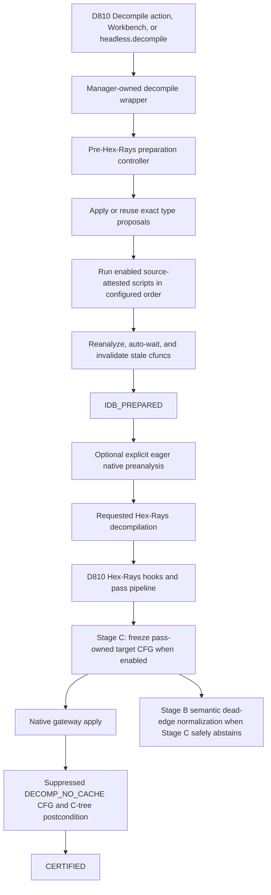

# Reversible IDB and Native Patching in D810

This document is the operator and architecture guide for D810's two durable
IDA mutation lanes:

1. **Pre-Hex-Rays IDB preparation** runs trusted, source-attested preparation
   steps before D810 requests a Hex-Rays decompilation.
2. **Native normalization** persists proof-owned deobfuscation results into
   IDA bytes or metadata after D810 has established a sufficiently strong
   semantic witness.

Both lanes are deliberately narrower than arbitrary IDAPython mutation. They
share durable database identity, exact before-images, conflict checks,
readback, startup recovery, explicit restoration, and fail-closed behavior,
but they have different authority and lifecycle boundaries.

## The two mutation lanes

| Property | Pre-Hex-Rays preparation | Native normalization |
| --- | --- | --- |
| Primary purpose | Prepare the IDB so the requested Hex-Rays run starts from a better native database | Make a proven D810 deobfuscation persist when D810 hooks are later disabled |
| Authority source | Explicit project script configuration or an enabled managed type-proposal step | Named issuer contract plus semantic proof, global availability, and per-function opt-in |
| Mutation surface | Managed patch bytes and exact serialized type changes | Native bytes and supported reversible IDA metadata actions |
| First terminal success | `IDB_PREPARED` | `CERTIFIED` |
| Initial apply invokes Hex-Rays? | No; refresh is deferred to the requested decompile | Yes when required for analysis cleanup; Stage C also performs an independent no-cache postcondition decompile |
| Restore | Exact byte patch status, byte values, and managed types | Exact inherited bytes, patch rows, items, xrefs, switch/function metadata, function state, and cache lifecycle within the supported action surface |
| Durable journal | `idb_preparation_journal.sqlite` | `native_patch_journal.sqlite` |

The execution-attempt provenance for native work is stored separately in
`native_patch_execution.sqlite`. Certificates and their links are stored in
D810's optimization storage, with a netnode-backed fallback when the normal
storage provider is unavailable.

## End-to-end decompilation flow



The ordering matters. Preparation changes the database that Hex-Rays will
read. Native normalization starts from evidence produced by a decompilation
and persists only what its issuer and proof authorize.

## What “pre-Hex-Rays hook” means

The preparation boundary cannot be an `Hexrays_Hooks` callback. By the time a
Hex-Rays maturity or flowchart callback fires, Hex-Rays has already started
constructing microcode from the IDB.

D810 instead owns the call into Hex-Rays:

- D810's disassembly **Decompile function** action calls
  `D810Manager.decompile_with_native_preanalysis()` before opening pseudocode.
- The Workbench's **Prepare & Decompile** command uses the same manager-owned
  lifecycle.
- `d810.headless.decompile()` uses the same wrapper.
- **Prepare only** and `d810.headless.prepare_idb_for_hexrays()` apply the IDB
  changes without requesting a decompilation.

The wrapper calls `prepare_idb_for_hexrays()` before optional native
preanalysis, lifecycle-session creation, cache invalidation, or the requested
decompile. Initial preparation may reanalyze and wait for IDA autoanalysis,
but it intentionally does not perform a controlled redo. The requested
decompile remains the first Hex-Rays run over the prepared IDB.

An ordinary IDA F5 request that does not pass through a D810-owned entry point
still runs D810's installed Hex-Rays optimization hooks, but it does not gain
the manager's pre-call preparation guarantee. Use the D810 decompile action,
Workbench command, or headless wrapper when preparation ordering matters.

## Configuring preparation scripts

Scripts are an ordered list in the project JSON. Relative paths resolve from
the project file's directory and are portable; absolute paths are accepted but
reported as non-portable.

```json
{
  "pre_hexrays": {
    "scripts": [
      {
        "id": "normalize-dispatcher",
        "display_name": "Normalize dispatcher",
        "path": "scripts/normalize_dispatcher.py",
        "enabled": true
      },
      {
        "id": "repair-items",
        "path": "scripts/repair_items.py",
        "enabled": false
      }
    ]
  }
}
```

Requirements:

- `id` must match `[a-z][a-z0-9_-]*` and be unique in the project.
- `path` must point to an existing `.py` file.
- `enabled` defaults to `true`.
- `display_name` defaults to the stable script ID.
- Execution order is configuration order.

At project activation, D810 reads each script once, computes its SHA-256, and
records an immutable descriptor. Immediately before execution the runner reads
the source again, verifies the hash, compiles those exact bytes, and executes
that compiled object. It never validates one file image and then asks a second
API to reopen a potentially replaced file.

If the source changes after project activation or Workbench preview, execution
abstains until the project is refreshed and the new source is reviewed.

## Preparation script API

Every script receives two globals:

- `function_ea`: the requested function entry EA.
- `preparation`: a `PreparationScriptContext` for managed changes.

A minimal managed byte patch looks like this:

```python
target_ea = function_ea + 0x24
preparation.patch_bytes(target_ea, b"\x90\x90")
preparation.note_function(function_ea)
```

The context exposes:

```python
preparation.patch_bytes(ea, data)
preparation.note_range(start_ea, end_ea)
preparation.note_function(function_ea)
```

`patch_bytes()` is the supported byte-writing path. It declares the complete
range first, durably captures every live before-byte and inherited patch row,
performs `ida_bytes.patch_bytes()`, and verifies readback.

`note_range()` exists for trusted scripts that are about to call a direct raw
IDA byte API. It must be called **before** the raw write because the old live
value cannot be recovered afterward. A raw `put_bytes()`/`put_byte()` change
does not enter IDA's patch ledger; D810 classifies it as
`UNMANAGED_WRITE_DETECTED` and rolls the transaction back. The declaration
makes that rollback lossless—it does not convert the unmanaged write into an
accepted managed patch.

`note_function()` records an affected function explicitly so D810 can
reanalyze it and invalidate its cfunc and callers. Managed byte ranges also
derive their function ownership automatically where IDA can resolve it.

### Trusted-script boundary

Preparation scripts run as trusted IDAPython on Python's main thread. They are
not security-sandboxed. The narrow context is a restoration contract, not a
security boundary.

The current generic restore guarantee covers:

- bytes changed through the managed patch path;
- inherited IDA patch status and value;
- declared raw byte before-images used for safe rejection/rollback; and
- managed exact type proposals.

It does **not** generically capture arbitrary IDA metadata mutations made by a
script, such as names, comments, structs, segments, function boundaries, or
xrefs. A script that directly changes those surfaces is outside the selective
undo contract unless a dedicated managed action is added for that metadata.

## Preparation transaction lifecycle

The durable lifecycle is:

```text
PREPARED
  -> SCRIPT_RUNNING
  -> CAPTURE_PENDING
  -> CAPTURED
  -> ANALYSIS_PENDING
  -> IDB_PREPARED
  -> RESTORING
  -> RESTORED
```

Failure and process-death lanes use `ROLLING_BACK`, `RESTORE_FAILED`, and
`RECOVERY_REQUIRED`. A script that fails before making any change may end in
`FAILED`; a request rejected before execution may end in `REJECTED`.

The journal atomically acquires the current database's preparation lease
before script execution. It records:

- database identity and anchor function;
- script ID, path, and source SHA-256;
- the initial IDA patch ledger;
- declared live byte before-images;
- exact before/after byte deltas and patch status;
- exact serialized type deltas;
- affected functions; and
- every lifecycle transition.

After capture, the gateway rejects conflicts with active native-patch ranges,
active preparation ranges, and already-owned type items. It then reanalyzes
affected functions, waits for autoanalysis, invalidates cached cfuncs and
callers, and stops at `IDB_PREPARED`. Cache refresh is deferred to the
requested decompile.

### Reuse and divergence

Preparation is idempotent by exact identity. D810 reuses an existing
`IDB_PREPARED` transaction only when all of these still match:

- database identity;
- anchor function;
- script ID, path, and source SHA-256;
- managed type-delta tuple; and
- live byte/type after-image.

If the exact transaction exists but its live after-image has diverged, D810
does not layer another run on top. It requires restoration or reconciliation.

### Restore

Explicit restore first verifies that every owned byte and type still equals
the transaction's after-image. If any value matches neither the before nor the
after image, the gateway reports interference instead of overwriting the
newer state.

On a clean restore, D810:

1. Reverts patch-layer bytes where the original state was unpatched.
2. Restores inherited raw values that differed from the input-file original.
3. Reinstalls inherited user/plugin patches where applicable.
4. Restores exact type presence or exact serialized type components.
5. Read-verifies the complete before-image.
6. Reanalyzes affected functions.
7. Invalidates affected cfuncs and callers.
8. Performs controlled redo for cfuncs that existed before restoration.

### Startup recovery

The manager opens `idb_preparation_journal.sqlite` and runs recovery before
installing the usable preparation controller. Recovery is filtered by the
durable UUID stored in the open IDB. Foreign-database transactions are never
replayed into the current database.

Interrupted `SCRIPT_RUNNING`, `CAPTURE_PENDING`, `CAPTURED`,
`ANALYSIS_PENDING`, and restore-lane states are reconciled from durable
before-images. The system tests include actual two-process `os._exit(91)`
cuts followed by a fresh IDB reopen, not only exception injection.

## Persistent global const annotations

The `constant-simplification` pass exposes an off-by-default option labeled
**Persist proven global constants in IDB**:

```json
{
  "pass_id": "constant-simplification",
  "options": {
    "persist_global_const_annotations": true
  }
}
```

The pass itself never writes a type from inside a Hex-Rays instruction
callback. It produces exact proposals containing the serialized before-type
and const-qualified after-type. The pre-Hex-Rays controller applies those
proposals through the same preparation journal.

Two discovery surfaces exist:

- Whole IDA data items referenced by the function can be evaluated before the
  requested decompile and applied in that preparation round.
- Dynamic bounded-table shapes discovered from microcode are queued at
  `MMAT_CALLS` and consumed by the next natural preparation round.

The type backend shares one exact `tinfo_t.serialize()`/`deserialize()`
implementation with native restoration. It preserves all three serialized
components and treats type absence as an exact restorable state. User types,
writable data, incomplete evidence, incompatible item sizes, and policy
failures are preserved or skipped rather than overwritten.

Restore these type transactions from the Workbench like any other preparation
transaction.

## Workbench interface

The Deobfuscation Workbench contains an **IDB preparation** section. It is a
projection over the manager and durable journal; the widget does not access
IDA or SQLite directly.

It shows:

- configured script order, display name, enabled state, source attestation,
  and portable/absolute path status;
- durable preparation transactions;
- byte and type change counts;
- whether the exact live after-image is present; and
- restore availability or its blocker.

Available actions are:

| Action | Behavior |
| --- | --- |
| **Preview** | Refreshes script attestations and the immutable projection; makes no IDB writes |
| **Prepare only** | Runs preparation and stops before Hex-Rays |
| **Prepare & Decompile** | Runs the manager-owned preparation plus requested decompile lifecycle |
| **Restore** | Restores the selected exact transaction when its after-image still matches |

The Workbench refuses execution from a stale snapshot, after script-source
drift, for a foreign database, or when the selected transaction is not in a
restorable state.

The script list is currently configured in project JSON; the Workbench reviews
and executes it but is not a general script editor.

## Headless interface

The headless API uses the same manager, journals, and hooks:

```python
from d810.headless import (
    configure,
    decompile,
    prepare_idb_for_hexrays,
    restore_idb_preparation,
    start,
    stop,
)

configure(project="my_project.json")
start()

# Optional: inspect/apply preparation without invoking Hex-Rays.
batch = prepare_idb_for_hexrays(0x401000)

# Normal managed path: preparation runs first, then Hex-Rays.
cfunc = decompile(0x401000)

for receipt in batch.run_receipts:
    restore_idb_preparation(receipt.transaction_id.value)

stop()
```

`decompile(..., eager_native_preanalysis=True)` is a separate explicit batch
option. It permits auxiliary microcode generation for exhaustive native
preanalysis. It is disabled by default and is not required for ordinary
pre-Hex-Rays script preparation.

## Native normalization stages

The Stage A/B/C names describe progressively stronger integration, not three
unconditional passes that always run.

### Stage A: prove a concrete native-safe result

Stage A established the semantic demonstration and the branch-direction
oracle. The dead-edge oracle recognizes two proof kinds:

- Z3-proven single-trip loop peel; and
- Z3-proven opaque predicate direction.

It is read-only. It cross-checks microcode-derived EAs against fresh native
decoding and produces candidates; it never calls an IDA write API. The
disposable-IDB demonstration requires the patched native program with D810
disabled to reproduce the D810-on pseudocode and then verifies native behavior
with an independent execution oracle before exact restoration.

### Stage B: production semantic issuance

Stage B turns proven dead-edge candidates into production native plans. The
manager:

1. Generates the proof input with D810 optimizer hooks suppressed.
2. Selects one deterministic homogeneous proof class when a function has
   mixed proof kinds.
3. Recaptures each native range and origin mapping.
4. Lowers only the action authorized by the proof.
5. Binds the proof digest to the target-CFG fingerprint.
6. Submits the plan under the exact named issuer contract.

Unsupported widths, malformed operands, origin ambiguity, proof failure, and
mixed or stale identity all abstain before journal preparation or IDB writes.
Deferred proof classes are recorded honestly; one function certificate owns
the slot until explicit restore.

### Stage C: persist the pass-owned final CFG

Stage C is enabled for the state-machine pipeline only when all native policy
checks pass and `lower_state_machine` explicitly enables persistence:

```json
{
  "pass_id": "lower_state_machine",
  "options": {
    "native_cfg_persistence": true
  }
}
```

During the D810 decompilation, the manager-owned collector records pass-owned
CFG mutations and freezes the final portable topology. It binds C-tree ranges
to native origins, builds one aggregate plan, and applies it through the same
gateway.

Stage C does not trust successful writes as its final proof. After application
it performs a fresh `DECOMP_NO_CACHE` decompilation with D810 optimization
suppressed, then checks:

- each patched operation still decodes to its expected after-shape;
- the live IDA flowchart's anchor quotient matches the frozen target CFG;
- the mapped C-tree range fingerprint matches; and
- the overall C-tree structural fingerprint matches.

The transaction remains in recoverable `POSTCONDITION_PENDING` until the live
CFG receipt and schema-3 certificate are durable. Only then does it transition
to `CERTIFIED`. A mismatch restores the overlay instead of certifying it.

## Native authorization policy

Native mutation requires both project-level availability and persisted
function-level consent:

```json
{
  "native_patch_enabled": true
}
```

The function must also carry D810's `native_patch:enabled` function tag. The
manager API is:

```python
manager.set_native_patch_opted_in(function_addr=function_ea, enabled=True)
manager.is_native_patch_opted_in(function_ea)
```

Stage C additionally requires `native_cfg_persistence=true` on
`lower_state_machine`. A profile, proof candidate, or configured issuer alone
is never authorization.

There is currently no dedicated Workbench control for the native-patch
function tag or native certificate restoration. Those operations remain
manager/gateway surfaces. This is distinct from the fully exposed Workbench
controls for pre-Hex-Rays preparation.

## Native plan and issuer contract

`NativePatchPlan` is provider-neutral. Every operation carries enough evidence
to reject stale state and reconstruct the inherited database:

- durable database identity and complete function identity;
- exact current and input-original bytes;
- inherited patch rows;
- before/after decoded instruction shapes;
- expected successors;
- encoding and independent decode evidence;
- relocation evidence;
- item, incoming-reference, switch, function-ownership, type, and flow state;
- supported metadata actions; and
- a complete restore snapshot.

Before preparing a transaction, `NativePatchGateway` validates the plan
against an immutable named issuer registry. Current production issuers are:

| Issuer | Class | Required authority |
| --- | --- | --- |
| `indirect-label-materializer` | Lifting normalization | Exact indirect-label discovery proof; metadata-only |
| `dead-edge-normalizer:single_trip_loop_peel` | Semantic deobfuscation | Matching single-trip proof and byte-writing plan |
| `dead-edge-normalizer:z3_opaque_predicate` | Semantic deobfuscation | Matching opaque-predicate proof and byte-writing plan |
| `stage-c-native-cfg-normalizer` | Semantic deobfuscation | Pass-owned native-CFG intent and byte-writing plan |

An arbitrary caller cannot gain authority by merely filling in `issuer_id` and
`proof_id`; patch class, proof vocabulary, provenance prefix, proof hashes, and
byte/metadata shape must all match the registered contract.

## Native gateway lifecycle

The main apply lane is:

```text
PREPARED
  -> BYTES_APPLIED
  -> METADATA_APPLIED          # only when actions exist
  -> ANALYSIS_PENDING
  -> ANALYSIS_VALIDATED
  -> CACHE_INVALIDATED
  -> CERTIFICATE_PENDING
  -> POSTCONDITION_PENDING     # Stage C only
  -> CERTIFIED
```

The gateway performs, in order:

1. Current-IDB identity validation.
2. Named issuer validation.
3. Atomic journal preparation and canonical function-slot lease acquisition.
4. Live preflight against bytes, patch rows, decoded shapes, metadata, origin,
   function ownership, and conflicts.
5. Per-byte write-ahead events and immediate readback.
6. Read-verify-apply-verify metadata primitives.
7. Reanalysis and auto-wait when mutation cleanup is required.
8. Complete post-reanalysis byte and metadata validation.
9. Target/caller cache invalidation and controlled redo.
10. Durable certificate and transaction link persistence.
11. Stage C's independent postcondition, when applicable.

One certificate slot is keyed by durable database identity and function entry
EA. A matching live certificate causes an `ALREADY_NORMALIZED` abstention. A
different or stale certificate blocks another plan and requires explicit
restore first. The SQLite slot lease is independent of chunk rows and is
acquired atomically, so empty chunk metadata or concurrent direct callers
cannot bypass exclusivity.

## Native metadata actions

Native restoration is not byte restoration alone. IDA state not derived from
bytes needs its own exact inverse. The metadata executor uses
read-verify-apply-verify primitives and journals the observed before-state.

The vocabulary includes:

- item recreation;
- code xref replacement, including xref type and the independent user flag;
- complete `switch_info_t` installation/removal;
- entry-chunk end changes; and
- detached function-tail chunk ownership.

Not every vocabulary item is executable for every observed state. Typed data,
entry-tail resizing, detached-tail adoption, planner-created switch records,
unknown item tails, and any representation without positive lossless
round-trip evidence fail closed. `OTHER` is never executable.

Function restore also preserves and verifies inherited function flags, exact
serialized prototypes, entry extent, detached tail ownership, and flow
references within the supported transaction surface.

## Restore and crash recovery

Explicit native restore requires a `CERTIFIED` transaction, or the controlled
pending Stage C restore lane used after postcondition failure. It verifies the
current state before changing it. Divergence becomes
`RECOVERY_REQUIRED`/interference rather than overwriting a user's newer edit.

The restore lane journals byte restoration before restoring metadata, function
extent/flow state, reanalysis, cache invalidation, controlled redo, and
certificate revocation. Interrupted `RESTORING`,
`RESTORE_BYTES_RESTORED`, and `RESTORE_FAILED` states are resumable.

Startup recovery is installed before the global native-enabled policy gate and
before production writer registration. It enumerates only recoverable rows for
the open IDB's durable UUID. `CERTIFICATE_PENDING` and
`POSTCONDITION_PENDING` remain recoverable because a patch is not certified
until its external certificate/link and Stage C observation are durable.

`RECOVERY_REQUIRED` is intentionally not auto-written. It represents a state
where interference or failed certificate cleanup requires explicit operator
acknowledgement before another destructive attempt.

## Known boundaries

The following limitations are intentional or currently unresolved:

- Preparation scripts are trusted and not security-sandboxed.
- Only managed preparation bytes and types have generic selective undo.
  Arbitrary metadata mutations from scripts do not.
- Raw `put_bytes()` writes are detected and rolled back, not accepted as
  managed patches.
- Native patching is x86/x64 branch-focused and uses a minimal supported
  encoding surface; unsupported architectures or instruction shapes abstain.
- Mixed Stage B proof classes are not combined into one certificate. The
  deterministic selected class is patched; deferred classes remain unchanged
  until explicit restore opens the function slot.
- The legacy `legacy_direct_indirect_materialization=true` compatibility
  profile still selects its older direct IDA mutator before the generic native
  opt-in gate. It is explicitly separate from the generic gateway and should
  not be cited as proof that all repository mutation is reversible.
- Generic native function opt-in and certificate restoration do not yet have
  dedicated Workbench controls.
- A green native gateway test proves the supported transaction surface, not
  that every IDA mutation route in the repository uses that gateway.

## Verification

Run all IDA-dependent tests from the main repository root. Replace `WORKTREE`
with the worktree name mounted by the Docker runner.

### Portable and journal-focused tests

```bash
./tools/scripts/run_system_tests_docker.sh test \
  -w WORKTREE \
  -o idb-patching-units.txt \
  -- \
  tests/unit/capabilities/test_idb_preparation.py \
  tests/unit/backends/ida/idb_preparation \
  tests/unit/backends/ida/native_patch \
  tests/unit/manager/test_pre_hexrays_preparation.py \
  tests/unit/manager/test_preparation_scripts.py \
  tests/unit/transforms/test_native_patch_plan.py \
  tests/unit/transforms/test_native_patch_lowering.py \
  -q
```

### Live IDA preparation and native gateway tests

```bash
./tools/scripts/run_system_tests_docker.sh test \
  -w WORKTREE \
  -o idb-patching-runtime.txt \
  -- \
  tests/system/runtime/backends/ida/test_native_patch_capture_preflight.py \
  tests/system/runtime/backends/ida/test_native_patch_gateway.py \
  tests/system/runtime/backends/ida/test_dead_edge_oracle_relations.py \
  tests/system/runtime/backends/hexrays/test_global_const_annotation.py \
  tests/system/e2e/test_pre_hexrays_idb_preparation.py \
  tests/system/e2e/test_native_normalization.py \
  tests/system/e2e/test_dead_edge_oracle_demonstration.py \
  tests/system/e2e/test_stage_c_native_cfg_normalization.py \
  -q
```

The E2E tests must use disposable copied IDBs. They assert exact before/apply/
restore bytes, inherited patch status, flowcharts, pseudocode or C-tree
fingerprints, types, certificates, and process-death recovery as appropriate.

### Architecture and formatting gates

From the target worktree:

```bash
ruff format --check src/d810 tests
ruff check src/d810 tests
sg scan --config sgconfig.yml --report-style short
PYTHONPATH=src lint-imports --config .importlinter
git diff --check
```

Focused or changed-file Ruff results must be described as such; repository-wide
Ruff status is a separate claim.

## Source map

### Portable contracts and plans

- `src/d810/capabilities/idb_preparation.py`
- `src/d810/capabilities/native_patch.py`
- `src/d810/transforms/native_patch_plan.py`
- `src/d810/transforms/native_patch_lowering.py`
- `src/d810/transforms/native_cfg_normalization.py`

### Pre-Hex-Rays preparation

- `src/d810/manager/preparation_scripts.py`
- `src/d810/manager/pre_hexrays_preparation.py`
- `src/d810/backends/ida/idb_preparation/gateway.py`
- `src/d810/backends/ida/idb_preparation/journal.py`
- `src/d810/backends/ida/idb_preparation/patch_ledger.py`
- `src/d810/backends/ida/idb_preparation/script_runner.py`
- `src/d810/backends/ida/idb_preparation/type_metadata.py`
- `src/d810/backends/ida/type_serialization.py`
- `src/d810/backends/hexrays/global_const_annotation.py`

### Native normalization

- `src/d810/backends/ida/native_patch/capture.py`
- `src/d810/backends/ida/native_patch/preflight.py`
- `src/d810/backends/ida/native_patch/encoder.py`
- `src/d810/backends/ida/native_patch/origin_mapper.py`
- `src/d810/backends/ida/native_patch/issuer.py`
- `src/d810/backends/ida/native_patch/gateway.py`
- `src/d810/backends/ida/native_patch/journal.py`
- `src/d810/backends/ida/native_patch/metadata.py`
- `src/d810/backends/ida/native_patch/dead_edge_oracle.py`
- `src/d810/backends/ida/native_patch/native_cfg_plan.py`
- `src/d810/backends/ida/native_patch/native_cfg_observer.py`
- `src/d810/manager/native_normalization.py`
- `src/d810/manager/native_writer_migration.py`
- `src/d810/manager/native_cfg_normalization.py`

### Entry points and UI

- `src/d810/manager/manager.py`
- `src/d810/ui/actions/decompile_function.py`
- `src/d810/manager/workbench_service.py`
- `src/d810/ui/workbench_preparation_panel.py`
- `src/d810/headless.py`
- `HEADLESS.md`

## Operator checklist

Before applying preparation or native normalization:

- Use the D810-owned decompile action, Workbench, or headless wrapper.
- Confirm the open IDB and function EA.
- Prefer project-relative preparation scripts.
- Refresh after editing script source.
- Use `preparation.patch_bytes()` for accepted byte changes.
- Keep direct metadata mutation out of scripts unless a managed action exists.
- Enable native patching globally only for projects that need it.
- Opt in each native-patch function explicitly.
- Inspect the Workbench preview and existing preparation transactions.
- Restore or reconcile a divergent applied transaction before layering another.

After applying:

- Confirm the transaction reached `IDB_PREPARED` or `CERTIFIED`.
- Confirm the requested fresh Hex-Rays result reflects the intended change.
- Preserve transaction and certificate IDs in diagnostic evidence.
- Restore through the gateway or Workbench; do not manually undo a subset of
  owned bytes and then expect the receipt to remain valid.
- If recovery reports interference, stop and inspect the current IDB rather
  than forcing restoration over unknown newer state.
