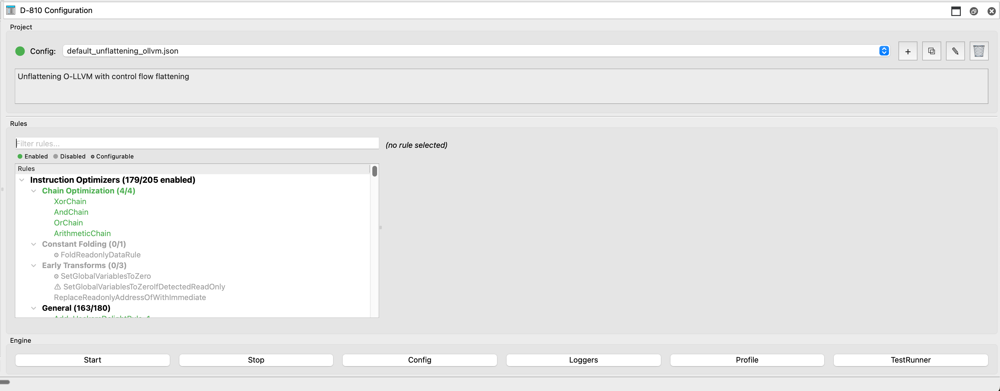
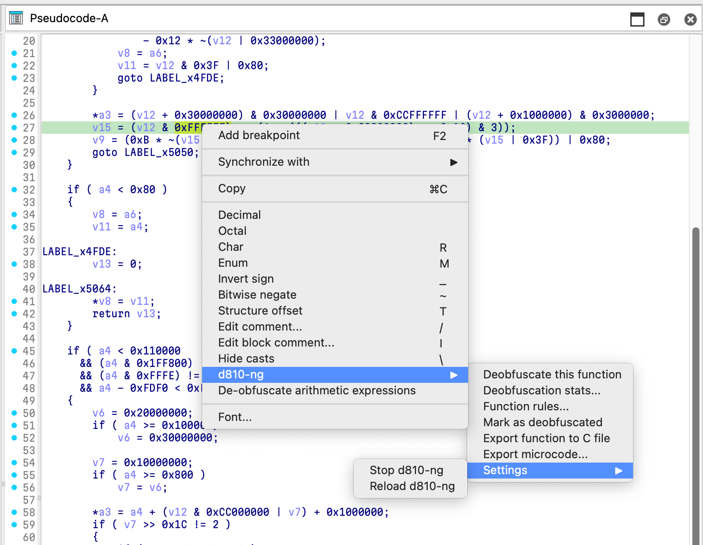
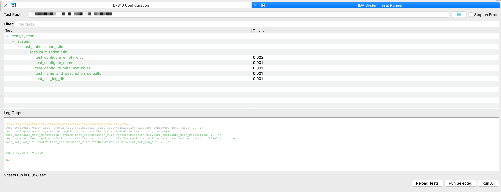
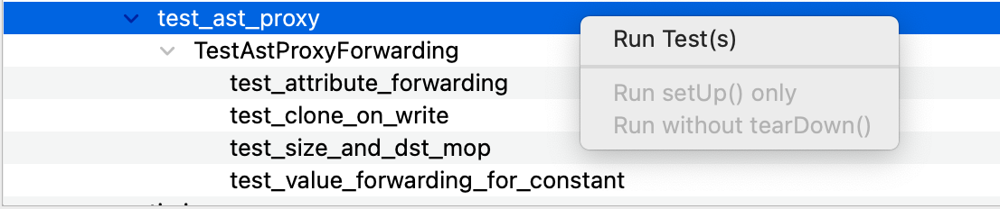
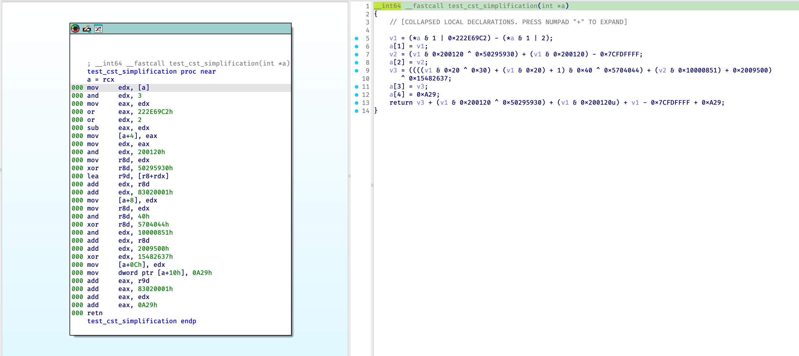
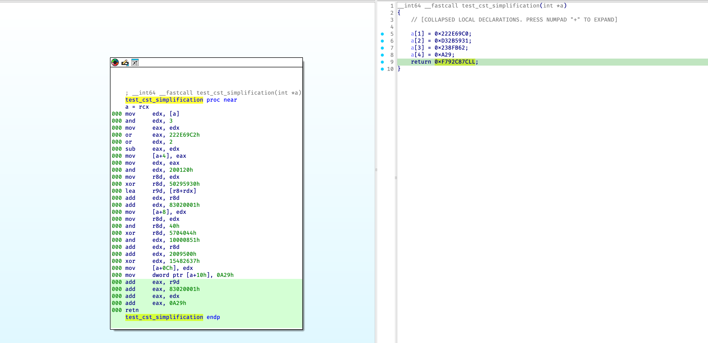
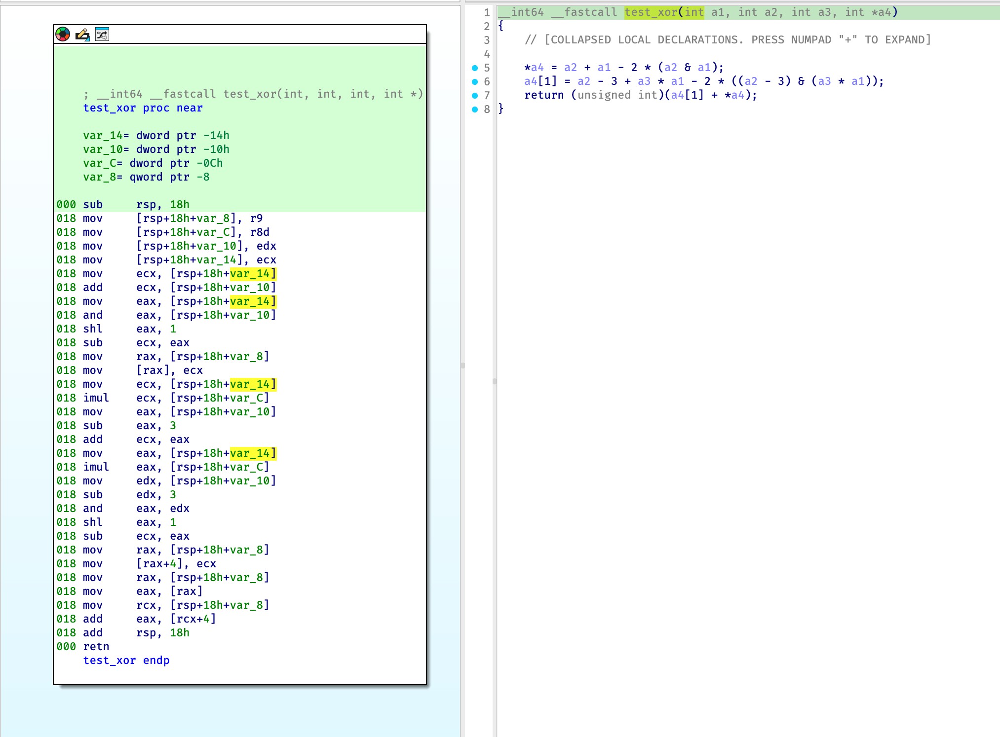
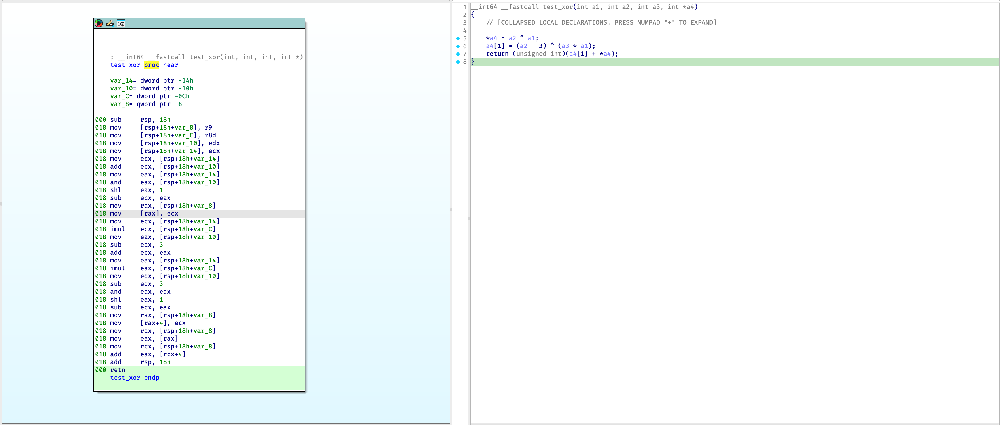

[](https://github.com/w00tzenheimer/d810-ng/actions/workflows/python.yml)

# Introduction

## What is D-810 ng

D-810 ng (Next Generation) is an IDA Pro plugin which can be used to deobfuscate code at decompilation time by modifying IDA Pro microcode.
It was designed with the following goals in mind:

* It should have as least as possible impact on our standard reverse engineering workflow
  * Fully integrated to IDA Pro
* It should be easily extensible and configurable
  * Fast creation of new deobfuscation rules
  * Configurable so that we don't have to modify the source code to use rules for a specific project
* Performance impact should be reasonable
  * Our goal is to be transparent for the reverse engineer
  * But we don't care if the decompilation of a function takes 1 more second if the resulting code is much simpler.

## D-810? What's that?

The name **D-810** is a wordplay on "deobfuscation", as illustrated by the mapping below:

```text
D E O B F U S C A T I O N
▲ ▲             ▲ ▲     ▲
│ │             │ │     │
D └───── 8 ─────┘ └─10──┘
```

## Using D-810 ng

Load the plugin by using the `Ctrl-Shift-D` shortcut, you should see this configuration GUI



Click on a rule to see more information about it:


## Features Overview

### Instruction-Level Optimizations

D-810 operates on IDA Hex-Rays microcode at multiple maturity levels. Instruction rules simplify obfuscated expressions before and during decompilation.

| Category | Rules | Description |
|----------|-------|-------------|
| **MBA (Mixed Boolean-Arithmetic)** | `Add`, `Sub`, `Mul`, `And`, `Or`, `Xor`, `Bnot`, `Neg`, `Mov` | Simplifies MBA-obfuscated expressions (e.g. `(a+b)-2*(a&b) => a^b`). Z3-verified DSL rules in `d810/mba/rules/`. |
| **Hacker's Delight** | `Add_HackersDelight*`, `And_HackersDelight*`, etc. | Bit-twiddling equivalences from Hacker's Delight. |
| **O-LLVM patterns** | `Add_OllvmRule_*`, `And_OllvmRule_*`, `Or_OllvmRule_1` | Obfuscator-LLVM-specific MBA patterns. |
| **Constant folding** | `CstSimplificationRule1–22` | Arithmetic and logical constant simplifications. |
| **Predicate simplifications** | `Pred0Rule*`, `PredFFRule*`, `PredSetzRule*`, `PredSetnzRule*` | Opaque predicate removal, setz/setnz/lnot/smod simplification. |
| **Factor rules** | `AndBnot_FactorRule_*`, `Xor_FactorRule_*`, etc. | Algebraic factorization and rewriting. |
| **Chain rules** | `AndChain`, `OrChain`, `XorChain`, `ArithmeticChain` | Simplifies chains of the same operation. |
| **Z3 rules** | `Z3ConstantOptimization`, `Z3setzRuleGeneric`, `Z3SmodRuleGeneric`, etc. | SMT-based simplification when template matching fails. |
| **Peephole** | `FoldReadonlyDataRule`, `LocalizedConstantPropagationRule` | Folds reads from readonly data, constant propagation. |
| **Hodur-specific** | `Xor_Hodur_1`, `Bnot_Hodur_1`, `Or_Hodur_1`, `Or_Hodur_2` | MBA patterns seen in Hodur (PlugX) malware. |

### Control-Flow Unflatteners

Flow optimizers restore natural control flow from flattened dispatchers. Rule order matters; unflatteners run in sequence.

| Unflattener | Target | Description |
|-------------|--------|-------------|
| **Unflattener** | O-LLVM | Removes O-LLVM-style control-flow flattening: switch/if-chain dispatcher with state variable. |
| **UnflattenerSwitchCase** | Tigress | Tigress with switch-case dispatcher (`m_jtbl`). |
| **UnflattenerTigressIndirect** | Tigress | Tigress with indirect jump (`m_ijmp`), requires `goto_table_info` config. |
| **HodurUnflattener** | Hodur (PlugX) | Nested `while(1)` state machines with `jnz state, #CONST`; no switch dispatcher. |
| **BadWhileLoop** | Approov | Approov-style `while(v8 != C)` with state constants in 0xF6000–0xF6FFF. |
| **UnflattenerFakeJump** | Generic | Removes conditional jumps that are always/never taken per predecessor. |
| **SingleIterationLoopUnflattener** | Residual | Cleans single-iteration loops: `INIT == CHECK` and `UPDATE != CHECK`. |
| **UnflattenControlFlowRule** (experimental) | Generic | Alternative CFG-based unflattener using path emulation. |

### Flow Optimizations (non-unflattening)

| Rule | Description |
|------|-------------|
| **BlockMerger** | Merges sequential blocks when safe. |
| **JumpFixer** | Resolves opaque/constant-condition jumps (``JnzRule*``, ``JbRule1``, ``JaeRule1``, ``CompareConstantRule*``, ``JmpRuleZ3Const``). |
| **GlobalConstantInliner** | Inlines global constants used as immediates. |
| **IndirectCallResolver** | Resolves `m_icall` via function-pointer table analysis. |
| **IndirectBranchResolver** | Resolves indirect branches via jump-table analysis. |
| **FixPredecessorOfConditionalJumpBlock** | Fixes predecessor edges when jump direction is known. |

### Supported Obfuscators / Patterns

| Obfuscator | Config | Unflattener(s) | Notes |
|------------|--------|----------------|-------|
| O-LLVM (obfuscator-llvm) | `default_unflattening_ollvm.json` | `Unflattener` | FLA + BCF + MBA. |
| Tigress | `default_unflattening_approov.json` | `UnflattenerSwitchCase`, `BadWhileLoop` | Switch-case and Approov-like patterns. |
| Approov | `default_unflattening_approov.json` | `UnflattenerSwitchCase`, `BadWhileLoop` | While-loop state constants in magic range. |
| Hodur (PlugX) | `hodur_deobfuscation.json`, `example_hodur.json` | `HodurUnflattener`, `Unflattener` | Hodur MBA + Hodur while-loop unflattening. |
| Tigress indirect | `example_libobfuscated.json` | `UnflattenerTigressIndirect` | Needs `goto_table_info` mapping. |

### DSL and Rule Verification

Adding new MBA rules is straightforward: define a pattern and replacement in pure symbolic form. No manual proofs, no IDA coupling at definition time. Rules are backend-agnostic; the same DSL tree is converted to Z3 for proving and to IDA AstNode for matching. The abstraction stays clean: `d810.mba.dsl` and `d810.mba.verifier` have no IDA or Z3 imports at the rule-definition level.

**Adding a rule:** subclass `VerifiableRule`, set `PATTERN` and `REPLACEMENT`. Registration and verification are automatic.

```python
from d810.mba.dsl import Var
from d810.mba.rules import VerifiableRule

x, y = Var("x_0"), Var("x_1")

class Xor_HackersDelightRule_1(VerifiableRule):
    PATTERN = (x | y) - (x & y)
    REPLACEMENT = x ^ y
    DESCRIPTION = "Simplify (x | y) - (x & y) to x ^ y"
```

**Correctness by construction:** `verify_rule()` proves `PATTERN` and `REPLACEMENT` equivalent via the Z3 backend. If verification fails, Z3 returns a counterexample. Tests parametrize over all registered rules, so new rules are verified automatically.

**Extensible constraints:** Constraints are declarative and backend-agnostic. The `VerificationEngine` protocol supports pluggable backends (Z3 and egglog today). Constraint forms include:

* Declarative `ConstraintExpr` (e.g. `bnot_x == ~x`, `c_minus_2 == Const("-2", -2)`)
* Runtime predicates (`when.equal_mops`, `when.is_bnot`) for IDA-specific checks; optionally attach additional backends for verification.
* Per-backend overrides via `get_constraints()` when a rule needs solver-specific logic.

Rules marked `SKIP_VERIFICATION = True` (e.g. microcode-type checks or very slow Z3 cases) are exempt but must be documented.

## Installation

**Only IDA v9 or later is supported with Python 3.10 and higher** (since we need the microcode Python API)

Copy the contents of this repository to `.idapro/plugins` or `%appdata%\Hex-Rays\IDA pro\plugins`.

To active [Cython](https://cython.org) speedups, there are pre-built wheels conveniently for many operating systems that `IDA Pro` runs on that can be installed via PyPI by doing:

`pip3 install d810-ng[speedups]`

Speedups are generously provided by [Mahmoud Abdelkader](https://mahmoudimus.com) who writes about how Cython ["super-charging the work-horse of reverse engineering"](https://mahmoudimus.com/blog/2025/08/ida-pro-and-cython-super-charging-the-work-horse-of-reverse-engineering/) gives C++ level performance with the same productivity of Python.

### Z3

Z3 is automatically installed when doing `pip3 install d810-ng[speedups]`, but if you do not want to use Cython, D-180 will automatically fallback to pure Python mode. If you want to use the SAT solver rules and several features of D-180, however, you must install `Z3` independently:

```bash
pip3 install z3-solver
```

### Install from source

To install D-810 ng as an editable package (useful for development or staying up to date with the repo):

```bash
pip install -e .
```

#### Building with Cython Speedups

d810 includes optional Cython extensions for performance-critical paths. Every Cython module has a pure Python fallback, so speedups are strictly optional.

#### Prerequisites

```bash
pip install "Cython>=3.0.0"
```

#### Local Build

**Without speedups (pure Python, all platforms):**

```bash
pip install -e .
```

This installs the package in development mode so that changes to the source are immediately reflected and works on every platform and requires no compiler or IDA SDK. All Cython modules have pure-Python fallbacks.

**macOS / Linux:**

```bash
# SDK auto-downloads from GitHub if not present
D810_BUILD_SPEEDUPS=1 pip install -e ".[speedups]" --no-build-isolation
```

To specify a local IDA SDK path:

```bash
IDA_SDK=/path/to/ida-sdk D810_BUILD_SPEEDUPS=1 pip install -e ".[speedups]" --no-build-isolation
```

**Windows (PowerShell):**

```powershell
$env:D810_BUILD_SPEEDUPS=1; $env:IDA_SDK="C:\IDA\9\sdk"; python -m pip install -e ".[speedups]" --no-build-isolation
```

**Build extensions in-place only (no install):**

```bash
D810_BUILD_SPEEDUPS=1 python setup.py build_ext --inplace
```

### Inside Docker (recommended)

Building inside an IDA container ensures SDK headers and symbols are available:

```bash
apt-get update && apt-get install -y g++
pip install setuptools wheel "Cython>=3.0.0"
D810_BUILD_SPEEDUPS=1 pip install --no-build-isolation -e ".[dev]"
```

### Environment Variables

| Variable | Purpose | Default |
|---|---|---|
| `D810_BUILD_SPEEDUPS` | Set to `1` to compile `.pyx` files | `0` (disabled) |
| `IDA_SDK` | Path to IDA SDK directory | Auto-downloads to `.ida-sdk/` |
| `DEBUG` | Set to `1` for debug builds with profiling/tracing | `0` |
| `D810_NO_CYTHON` | Set to `1` to disable Cython at runtime | Not set (enabled) |

> **Note:** `--no-build-isolation` is important so pip uses your already-installed Cython rather than creating an isolated build environment.

## How to use D810

1. Choose or create your project configuration. If you are not sure what to do here, leave *default_instruction_only.json*.
2. Click on the `Start` button to enable deobfuscation
3. Decompile an obfuscated function, the code should be simplified (hopefully)

When you want to disable deobfuscation, just click on the `Stop` button or use the context menus:




## Adding New Obfuscation Examples

In `samples/src`, there are various `C` programs compiled using the `samples/Makefile` into a shared library, without optimizations (`-O0`). On Windows, that shared library is a `.dll`; on macOS, it is a `.dylib`; on Linux, it is a `.so`. Included is an example compiled DLL, `libobfuscated.dll`, that can serve as a testing ground for seeing the plugin in action. Please make a pull request with more obfuscation `C` examples to build a repository of obfuscated sample code for further research.

### Test Runner

D-810 ng comes with a built-in test runner that loads IDA runtime tests from the tests folder (primarily under `tests/system`). This GUI is a simple test runner that allows a developer to run tests *inside* of IDA Pro, accessing the hexrays decompiler API and utilizing specific samples under `samples/bins` to test transformations.

The test runner is self-explanatory:



Test reloading exists without needing to restart `IDA Pro` and you can execute different part of the tests via the testing context menu:



### How to build

The sample binaries are built via the `samples/Makefile`. You can cross-target OS and architecture.

* Output name:
  * default (`BINARY_NAME` untouched): `bins/<BINARY_NAME>_<hostos>_<arch>.<suffix>`
  * explicit `BINARY_NAME` (CLI/env): `bins/<BINARY_NAME>.<suffix>`
  * `<BINARY_NAME>` defaults to `libobfuscated`
  * `<hostos>` is the machine running `make` (`darwin`, `linux`, `windows`)
  * `<arch>` is normalized (`x86_64` or `arm64`)
  * `<suffix>` comes from target OS: `dll` (windows), `dylib` (darwin), `so` (linux)

Flags you can pass to `make`:

* `TARGET_OS` (default: `windows`)
  * One of: `windows`, `darwin`, `linux`, `native`
  * `native` is normalized to the detected host OS (`darwin`, `linux`, or `windows`)
* `BUILD_ARCH` (default: `x86_64`)
  * Examples: `x86_64`, `x86`, `arm64`
  * `x86` is normalized to `x86_64` (32-bit builds are not supported)
  * Also accepts explicit compiler flags (e.g., `-m64`, `-arch arm64`)
* `BINARY_NAME` (default: `libobfuscated`)

Notes:

* Builds are unoptimized by default: `-O0 -g` and inlining/vectorization are disabled.
* On non-Linux hosts, `TARGET_OS=linux` automatically uses Docker to produce true ELF output.
* Linux Docker build selects platform from `BUILD_ARCH`:
  * `x86_64` -> `linux/amd64`
  * `arm64` -> `linux/arm64`
* On non-Windows hosts, `TARGET_OS=windows` uses Docker when no explicit Windows sysroot/toolchain is provided.

Examples (run from the repo root):

```bash
# Build defaults: Windows DLL (name includes host+arch by default)
cd samples && make
# → bins/libobfuscated_<hostos>_x86_64.dll

# Build Linux .so for x86_64 ELF
make TARGET_OS=linux BUILD_ARCH=x86_64
# → bins/libobfuscated_<hostos>_x86_64.so

# Build Linux .so for arm64 ELF
make TARGET_OS=linux BUILD_ARCH=arm64
# → bins/libobfuscated_<hostos>_arm64.so

# Build macOS .dylib for x86_64
make TARGET_OS=darwin BUILD_ARCH=x86_64
# → bins/libobfuscated_<hostos>_x86_64.dylib

# Build for the native host OS (x86 maps to x86_64)
make TARGET_OS=native BUILD_ARCH=x86
# → bins/libobfuscated_<hostos>_x86_64.<ext>

# Customize binary name
make BINARY_NAME=libobfuscatedv2
# → bins/libobfuscatedv2.dll (or .so/.dylib based on TARGET_OS)

# Clean artifacts
make clean
```

### Test Constant Simplifications

**Before**: 

**After**: 

### Test XOR Simplifications

**Before**: 

**After**: 

## Running Tests

D-810 ng has a comprehensive test suite that runs inside IDA Pro's headless mode (`idalib`). Tests are executed in Docker containers that bundle IDA Pro with the required Python environment.

**Prerequisites:**

* Docker and Docker Compose
* Access to the `ghcr.io/w00tzenheimer/idapro-linux` container images

### Quick Start

```bash
# Run all IDA system tests (excludes profiling tests by default)
docker compose run --rm --entrypoint bash idapro-tests-9.2 -c \
  "pip install -e .[dev] -q && pytest tests/system/ -v --tb=short"
```

### Test Categories

| Marker | Description | Default |
|--------|-------------|---------|
| `pure_python` | Tests that run without IDA Pro (fast, no external dependencies) | Included |
| `requires_ida` | Tests that require IDA Pro to run | Included |
| `slow` | Slow tests (>10s) — typically Z3 verification or complex deobfuscation | Included |
| `profile` | Performance profiling tests (decompiles functions repeatedly) | **Excluded** |

### Running Specific Test Suites

```bash
# Run only unit tests (no IDA required)
pytest tests/unit/ -v

# Run IDA system tests
docker compose run --rm --entrypoint bash idapro-tests-9.2 -c \
  "pip install -e .[dev] -q && pytest tests/system/ -v --tb=short"

# Run a specific test class
docker compose run --rm --entrypoint bash idapro-tests-9.2 -c \
  "pip install -e .[dev] -q && pytest tests/system/e2e/test_libdeobfuscated_dsl.py::TestOLLVMPatterns -v --tb=short"

# Run profiling tests (excluded by default, opt-in only)
docker compose run --rm --entrypoint bash idapro-tests-9.2 -c \
  "pip install -e .[dev] -q && pytest tests/system/e2e/test_profile_libobfuscated.py -m profile -v -s"

# Override default marker filter to run everything
docker compose run --rm --entrypoint bash idapro-tests-9.2 -c \
  "pip install -e .[dev] -q && pytest tests/system/ -o 'addopts=' -v"
```

See `tests/TEST_CLASSIFICATION.md` for strict test placement rules and lane definitions.

### Docker Services

| Service | Image | Python | Description |
|---------|-------|--------|-------------|
| `idapro-tests` | `idapro-linux:idapro-tests` | 3.10 | Legacy test container |
| `idapro-tests-9.2` | `idapro-linux:idapro-tests-9.2-py312` | 3.12 | Primary test container (recommended) |

## Warnings

This plugin is still in early stage of development, so issues ~~may~~ will happen.

* Modifying incorrectly IDA microcode may lead IDA to crash. We try to detect that as much as possible to avoid crash, but since it may still happen **save you IDA database often**
* Plugin is tested on Windows, Mac and Linux.

## Documentation

Work in progress

Currently, you can read our [blog post](https://eshard.com/posts/) to get some information.

## Licenses

This library is licensed under LGPL V3 license. See the [LICENSE](LICENSE) file for details.

## Authors

See [AUTHORS](AUTHORS.md) for the list of contributors to the project.

## Acknowledgement

Rolf Rolles for the huge work he has done with his [HexRaysDeob plugin](https://github.com/RolfRolles/HexRaysDeob) and all the information about Hex-Rays microcode internals described in his [blog post](https://www.hex-rays.com/blog/hex-rays-microcode-api-vs-obfuscating-compiler/). We are still using some part of his plugin in D-810.

Dennis Elser for the [genmc plugin](https://github.com/patois/genmc) plugin which was very helpful for debugging D-810 errors.

A special thank you to [Boris Batteux](https://gitlab.com/borisbatteux) for this great plugin!
