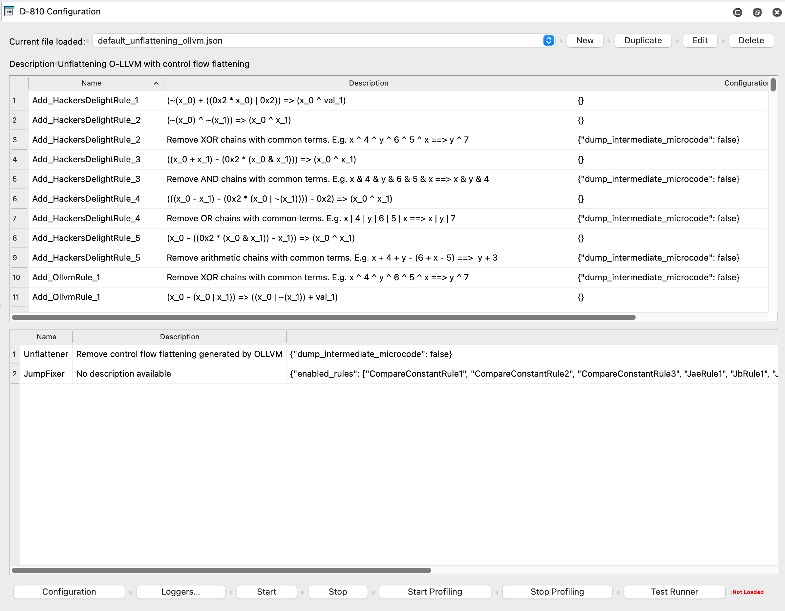
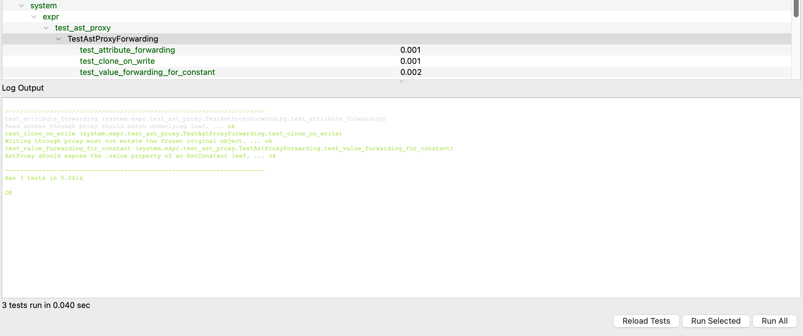
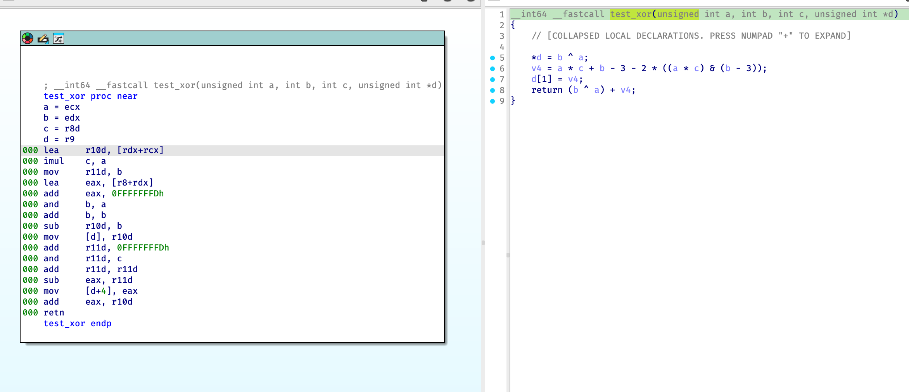

[](https://github.com/w00tzenheimer/d810-ng/actions/workflows/python.yml)

# Introduction

## What is D-810 ng

D-810 ng (Next Generation) is an IDA Pro plugin which can be used to deobfuscate code at decompilation time by modifying IDA Pro microcode.
It was designed with the following goals in mind:

* It should have as least as possible impact on our standard reverse engineering workflow
  * Fully integrated to IDA Pro
* It should be easily extensible and configurable
  * Fast creation of new deobfuscation rules
  * Configurable so that we don't have to modify the source code to use rules for a specific project
* Performance impact should be reasonable
  * Our goal is to be transparent for the reverse engineer
  * But we don't care if the decompilation of a function takes 1 more second if the resulting code is much simpler.

## Installation

**Only IDA v9 or later is supported with Python 3.10 and higher** (since we need the microcode Python API)

Copy the contents of this repository to `.idapro/plugins` or `%appdata%\Hex-Rays\IDA pro\plugins`.

It is recommended to install Z3 to be able to use several features of D-810:

```bash
pip3 install z3-solver
```

### Install from source

To install D-810 ng as an editable package (useful for development or staying up to date with the repo):

```bash
pip install -e .
```

This installs the package in development mode so that changes to the source are immediately reflected.

## Using D-810 ng

* Load the plugin by using the `Ctrl-Shift-D` shortcut, you should see this configuration GUI



* Choose or create your project configuration
  * If you are not sure what to do here, leave *default_instruction_only.json*.
* Click on the `Start` button to enable deobfuscation
* Decompile an obfuscated function, the code should be simplified (hopefully)
* When you want to disable deobfuscation, just click on the `Stop` button.

### Test Runner

D-810 ng comes with a built-in test runner that automatically loads system tests from the tests folder, under `tests/system`. This GUI is a simple test runner that allows a developer to run tests *inside* of IDA Pro, accessing the hexrays decompiler API and utilizing specific samples under `samples/bins` to test transformations.

The test runner is self-explanatory:



Test reloading exists without needing to restart `IDA Pro` and you can execute different part of the tests via the testing context menu:


## Examples

In `samples/src`, there are various `C` programs compiled using the `samples/src/Makefile` into a shared library, without optimizations (`-O0`). On Windows, that shared library is a `.dll`, on Darwin(Mac)/Linux, it is a `.so`. Included is an example compiled dll, `libobfuscated.dll`, that can serve as a testing ground for seeing the plugin in action. Please make a pull request with more obfuscation `C` examples to build a repository of obfuscated sample code for further research.

### How to build

The sample binaries are built via the `samples/Makefile`. You can cross-target OS and architecture.

* Default output name: `bins/<binary_name>_<hostos>_<arch>.<suffix>`
  * `<binary_name>` defaults to `libobfuscated` (override with `BINARY_NAME`)
  * `<hostos>` is the system you build on: `windows`, `darwin`, or `linux`
  * `<arch>` is the requested build arch (normalized): `x86_64`, `x86`, `arm64`, …
  * `<suffix>` comes from the target OS: `dll` (windows), `dylib` (darwin), `so` (linux)
* If you explicitly set `BINARY_NAME` (env or CLI), the output name is simplified to: `bins/<BINARY_NAME>.<suffix>`

Flags you can pass to `make`:

* `TARGET_OS` (default: `windows`)
  * One of: `windows`, `darwin`, `linux`, `native` (uses the host OS)
* `BUILD_ARCH` (default: `x86_64`)
  * Examples: `x86_64`, `x86`, `arm64`
  * Also accepts explicit compiler flags (e.g., `-m64`, `-m32`)
  * On macOS we use `-arch <name>` under the hood (e.g., `-arch x86_64`)
* `BINARY_NAME` (default: `libobfuscated`)

Notes:

* Builds are unoptimized by default: `-O0 -g` and inlining/vectorization are disabled.
* We rely on the host toolchain for linking. `TARGET_OS` selects the output suffix; cross-linking toolchains are up to your environment.

Examples (run from the repo root):

```bash
# Build defaults: Windows DLL for x86_64; name includes your host OS
cd samples && make
# → bins/libobfuscated_<hostos>_x86_64.dll

# Build Linux .so for arm64
make TARGET_OS=linux BUILD_ARCH=arm64
# → bins/libobfuscated_<hostos>_arm64.so

# Build macOS .dylib for x86_64
make TARGET_OS=darwin BUILD_ARCH=x86_64
# → bins/libobfuscated_<hostos>_x86_64.dylib

# Build for the native host OS, 32-bit x86
make TARGET_OS=native BUILD_ARCH=x86
# → bins/libobfuscated_<hostos>_x86.<ext>

# Customize the base name (explicit BINARY_NAME removes host/arch suffixes)
make BINARY_NAME=libobfuscatedv2
# → bins/libobfuscatedv2.<ext>

# Clean artifacts
make clean
```

### Test Constant Simplifications

**Before**: 

**After**: 

### Test XOR Simplifications

**Before**: 

**After**: 

## Running Tests

D-810 ng has a comprehensive test suite that runs inside IDA Pro's headless mode (`idalib`). Tests are executed in Docker containers that bundle IDA Pro with the required Python environment.

### Prerequisites

- Docker and Docker Compose
- Access to the `ghcr.io/w00tzenheimer/idapro-linux` container images

### Quick Start

```bash
# Run all system tests (excludes profiling tests by default)
docker compose run --rm --entrypoint bash idapro-tests-9.2 -c \
  "pip install -e .[dev] -q && pytest tests/system/ -v --tb=short"
```

### Test Categories

| Marker | Description | Default |
|--------|-------------|---------|
| `pure_python` | Tests that run without IDA Pro (fast, no external dependencies) | Included |
| `requires_ida` | Tests that require IDA Pro to run | Included |
| `slow` | Slow tests (>10s) — typically Z3 verification or complex deobfuscation | Included |
| `profile` | Performance profiling tests (decompiles functions repeatedly) | **Excluded** |

### Running Specific Test Suites

```bash
# Run only unit tests (no IDA required)
pytest tests/unit/ -v

# Run a specific test class
docker compose run --rm --entrypoint bash idapro-tests-9.2 -c \
  "pip install -e .[dev] -q && pytest tests/system/test_libdeobfuscated_dsl.py::TestOLLVMPatterns -v --tb=short"

# Run profiling tests (excluded by default, opt-in only)
docker compose run --rm --entrypoint bash idapro-tests-9.2 -c \
  "pip install -e .[dev] -q && pytest tests/system/test_profile_libobfuscated.py -m profile -v -s"

# Override default marker filter to run everything
docker compose run --rm --entrypoint bash idapro-tests-9.2 -c \
  "pip install -e .[dev] -q && pytest tests/system/ -o 'addopts=' -v"
```

### Docker Services

| Service | Image | Python | Description |
|---------|-------|--------|-------------|
| `idapro-tests` | `idapro-linux:idapro-tests` | 3.10 | Legacy test container |
| `idapro-tests-9.2` | `idapro-linux:idapro-tests-9.2-py312` | 3.12 | Primary test container (recommended) |

## Building with Cython Speedups

d810 includes optional Cython extensions for performance-critical paths. Every Cython module has a pure Python fallback, so speedups are strictly optional.

### Prerequisites

```bash
pip install "Cython>=3.0.0"
```

### Local Build

**Without speedups (pure Python, all platforms):**

```bash
pip install -e .
```

This works on every platform and requires no compiler or IDA SDK. All Cython modules have pure-Python fallbacks.

**macOS / Linux:**

```bash
# SDK auto-downloads from GitHub if not present
D810_BUILD_SPEEDUPS=1 pip install -e ".[speedups]" --no-build-isolation
```

To specify a local IDA SDK path:

```bash
IDA_SDK=/path/to/ida-sdk D810_BUILD_SPEEDUPS=1 pip install -e ".[speedups]" --no-build-isolation
```

**Windows (PowerShell):**

```powershell
$env:D810_BUILD_SPEEDUPS=1; $env:IDA_SDK="C:\IDA\9\sdk"; python -m pip install -e ".[speedups]" --no-build-isolation
```

**Build extensions in-place only (no install):**

```bash
D810_BUILD_SPEEDUPS=1 python setup.py build_ext --inplace
```

### Inside Docker (recommended)

Building inside an IDA container ensures SDK headers and symbols are available:

```bash
apt-get update && apt-get install -y g++
pip install setuptools wheel "Cython>=3.0.0"
D810_BUILD_SPEEDUPS=1 pip install --no-build-isolation -e ".[dev]"
```

### Environment Variables

| Variable | Purpose | Default |
|---|---|---|
| `D810_BUILD_SPEEDUPS` | Set to `1` to compile `.pyx` files | `0` (disabled) |
| `IDA_SDK` | Path to IDA SDK directory | Auto-downloads to `.ida-sdk/` |
| `DEBUG` | Set to `1` for debug builds with profiling/tracing | `0` |
| `D810_NO_CYTHON` | Set to `1` to disable Cython at runtime | Not set (enabled) |

> **Note:** `--no-build-isolation` is important so pip uses your already-installed Cython rather than creating an isolated build environment.

## Warnings

This plugin is still in early stage of development, so issues ~~may~~ will happen.

* Modifying incorrectly IDA microcode may lead IDA to crash. We try to detect that as much as possible to avoid crash, but since it may still happen **save you IDA database often**
* Plugin is tested on Windows, Mac and Linux.

## Documentation

Work in progress

Currently, you can read our [blog post](https://eshard.com/posts/) to get some information.

## Licenses

This library is licensed under LGPL V3 license. See the [LICENSE](LICENSE) file for details.

## Authors

See [AUTHORS](AUTHORS.md) for the list of contributors to the project.

## Acknowledgement

Rolf Rolles for the huge work he has done with his [HexRaysDeob plugin](https://github.com/RolfRolles/HexRaysDeob) and all the information about Hex-Rays microcode internals described in his [blog post](https://www.hex-rays.com/blog/hex-rays-microcode-api-vs-obfuscating-compiler/). We are still using some part of his plugin in D-810.

Dennis Elser for the [genmc plugin](https://github.com/patois/genmc) plugin which was very helpful for debugging D-810 errors.

A special thank you to [Boris Batteux](https://gitlab.com/borisbatteux) for this great plugin!
