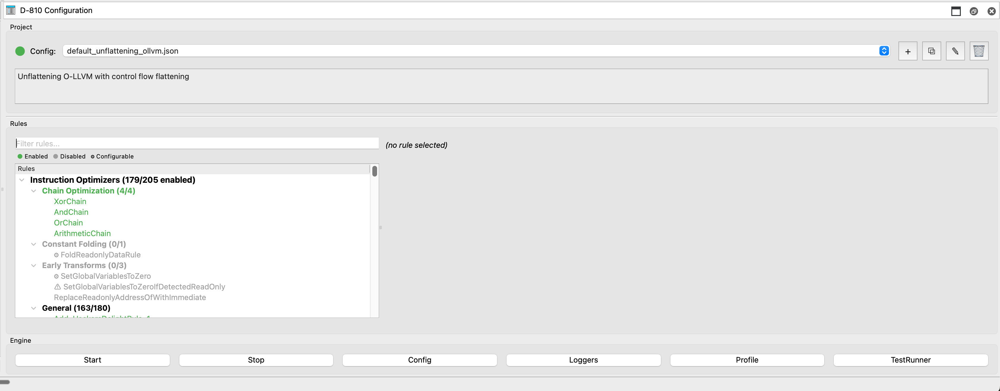
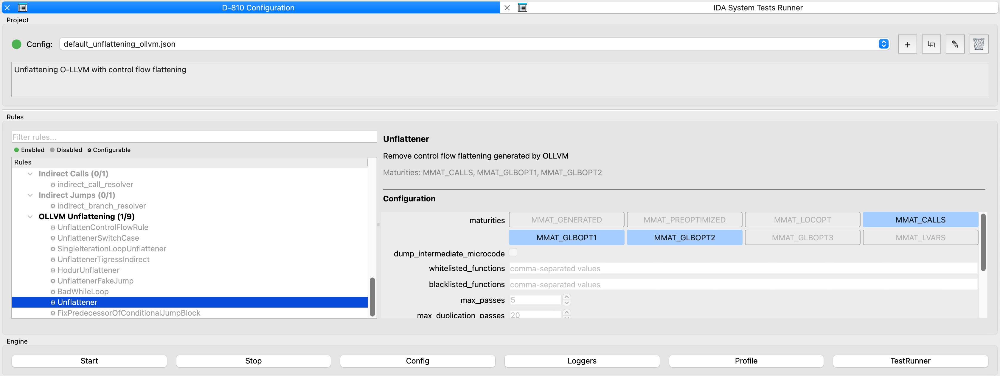
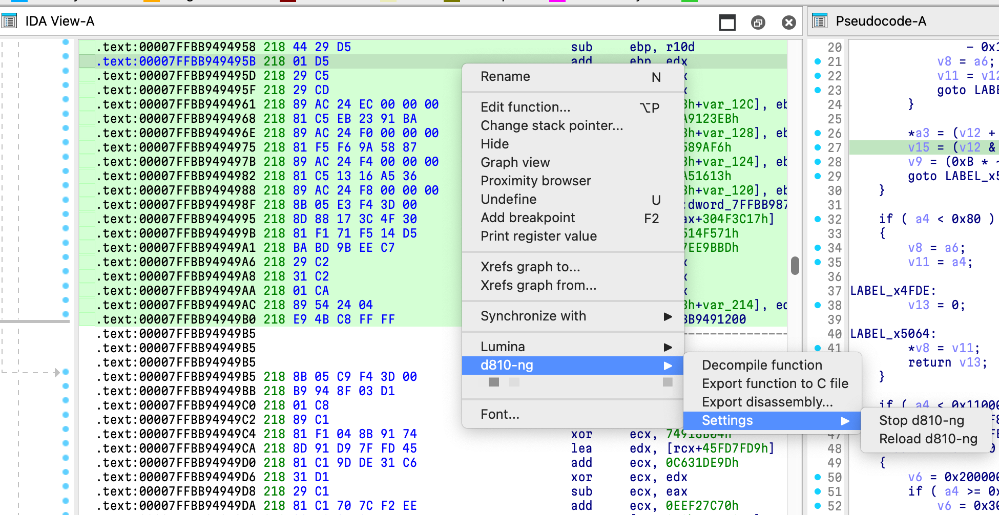
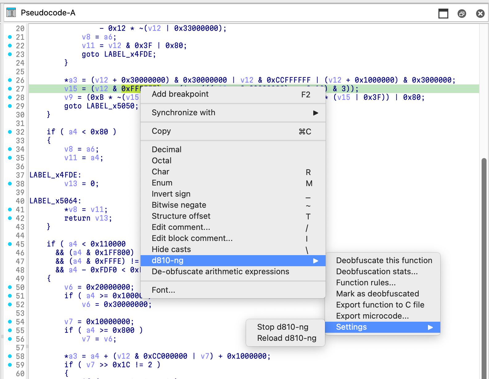
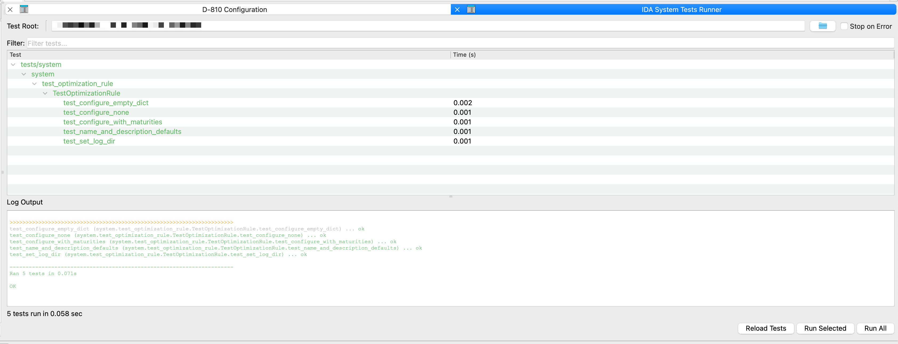
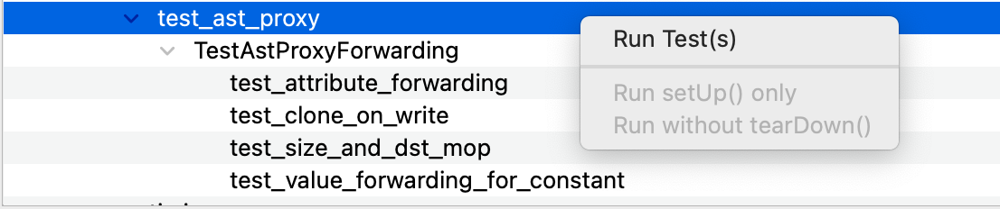
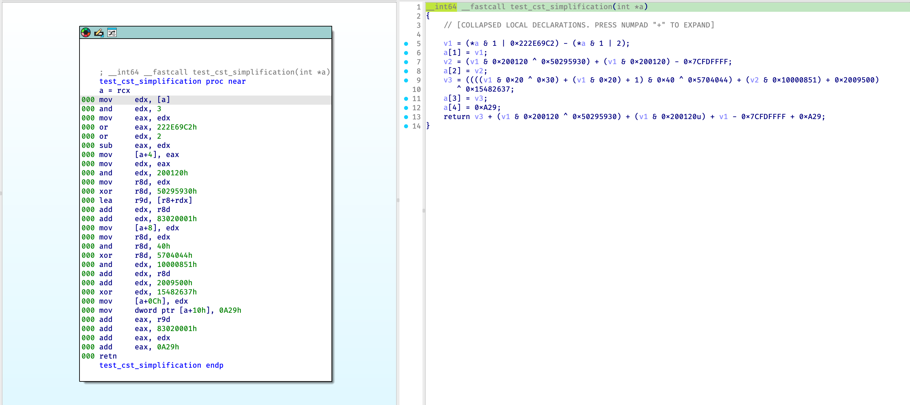
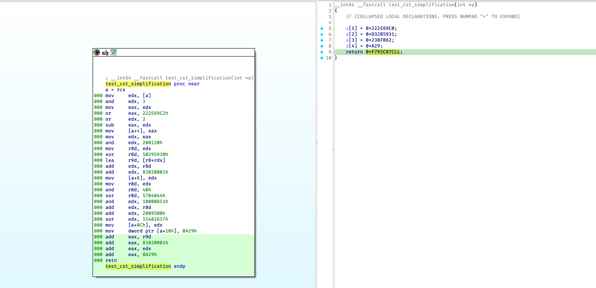
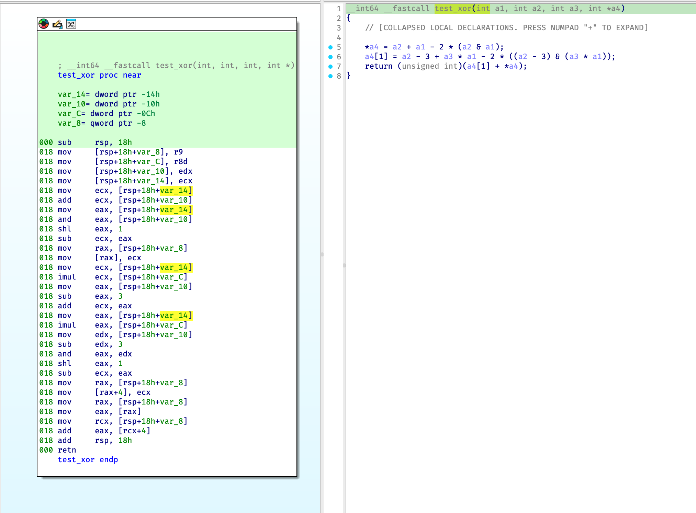
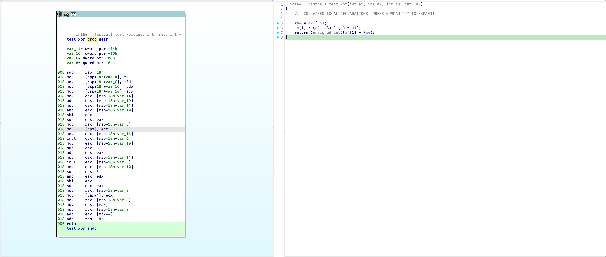

[](https://github.com/w00tzenheimer/d810-ng/actions/workflows/python.yml)

# Introduction

## What is D-810 ng

D-810 ng (Next Generation) is an IDA Pro plugin which can be used to deobfuscate code at decompilation time by modifying IDA Pro microcode.
It was designed with the following goals in mind:

* It should have as least as possible impact on our standard reverse engineering workflow
  * Fully integrated to IDA Pro
* It should be easily extensible and configurable
  * Fast creation of new deobfuscation rules
  * Configurable so that we don't have to modify the source code to use rules for a specific project
* Performance impact should be reasonable
  * Our goal is to be transparent for the reverse engineer
  * But we don't care if the decompilation of a function takes 1 more second if the resulting code is much simpler.

## D-810? What's that?

The name **D-810** is a wordplay on "deobfuscation", as illustrated by the mapping below:

```text
D E O B F U S C A T I O N
▲ ▲             ▲ ▲     ▲
│ │             │ │     │
D └───── 8 ─────┘ └─10──┘
```

## Using D-810 ng

Load the plugin by using the `Ctrl-Shift-D` shortcut, you should see this configuration GUI



Click on a rule to see more information about it:



## Features Overview

### Instruction-Level Optimizations

D-810 operates on IDA Hex-Rays microcode at multiple maturity levels. Instruction rules simplify obfuscated expressions before and during decompilation.

| Category | Rules | Description |
|----------|-------|-------------|
| **MBA (Mixed Boolean-Arithmetic)** | `Add`, `Sub`, `Mul`, `And`, `Or`, `Xor`, `Bnot`, `Neg`, `Mov` | Simplifies MBA-obfuscated expressions (e.g. `(a+b)-2*(a&b) => a^b`). Z3-verified DSL rules in `d810/mba/rules/`. |
| **Hacker's Delight** | `Add_HackersDelight*`, `And_HackersDelight*`, etc. | Bit-twiddling equivalences from Hacker's Delight. |
| **O-LLVM patterns** | `Add_OllvmRule_*`, `And_OllvmRule_*`, `Or_OllvmRule_1` | Obfuscator-LLVM-specific MBA patterns. |
| **Constant folding** | `CstSimplificationRule1–22` | Arithmetic and logical constant simplifications. |
| **Predicate simplifications** | `Pred0Rule*`, `PredFFRule*`, `PredSetzRule*`, `PredSetnzRule*` | Opaque predicate removal, setz/setnz/lnot/smod simplification. |
| **Factor rules** | `AndBnot_FactorRule_*`, `Xor_FactorRule_*`, etc. | Algebraic factorization and rewriting. |
| **Chain rules** | `AndChain`, `OrChain`, `XorChain`, `ArithmeticChain` | Simplifies chains of the same operation. |
| **Z3 rules** | `Z3ConstantOptimization`, `Z3setzRuleGeneric`, `Z3SmodRuleGeneric`, etc. | SMT-based simplification when template matching fails. |
| **Peephole** | `FoldReadonlyDataRule`, `LocalizedConstantPropagationRule` | Folds reads from readonly data, constant propagation. |
| **Hodur-specific** | `Xor_Hodur_1`, `Bnot_Hodur_1`, `Or_Hodur_1`, `Or_Hodur_2` | MBA patterns seen in Hodur (PlugX) malware. |

### Control-Flow Unflatteners

Flow optimizers restore natural control flow from flattened dispatchers. The current unflattening path is engine-profile based: recon produces dispatcher/value-flow evidence, cfg plans typed graph modifications, and Hex-Rays materializes the plan.

| Engine rule | Target | Description |
|-------------|--------|-------------|
| **EmulatedDispatcherUnflattener** | OLLVM / Tigress switch / Tigress indirect / Approov-style dispatchers | Shared dispatcher engine with profiles for equality-chain, switch-table, indirect-transfer, and dynamic state-machine shapes. |
| **HodurUnflattener** | Hodur (PlugX) | Hodur-specific state-machine strategy family and priors. |
| **SimpleFlatteningCleanupUnflattener** | Generic cleanup | Shared cleanup family for fake jumps, single-iteration loops, bad-while-loop shapes, and predecessor branch-arm repairs. |
| **UnflattenControlFlowRule** (experimental) | Generic | Alternative CFG-based unflattener using path emulation. |

### Flow Optimizations (non-unflattening)

| Rule | Description |
|------|-------------|
| **BlockMerger** | Merges sequential blocks when safe. |
| **JumpFixer** | Resolves opaque/constant-condition jumps (``JnzRule*``, ``JbRule1``, ``JaeRule1``, ``CompareConstantRule*``, ``JmpRuleZ3Const``). |
| **GlobalConstantInliner** | Inlines global constants used as immediates. |
| **IndirectCallResolver** | Resolves `m_icall` via function-pointer table analysis. |
| **IndirectBranchResolver** | Resolves indirect branches via jump-table analysis. |

### Supported Obfuscators / Patterns

| Obfuscator | Config | Engine path | Notes |
|------------|--------|-------------|-------|
| O-LLVM (obfuscator-llvm) | `default_unflattening_ollvm.json` | `EmulatedDispatcherUnflattener` | FLA + BCF + MBA through the OLLVM dispatcher profile. |
| Tigress switch | `default_unflattening_tigress_engine_transition_facts.json` | `EmulatedDispatcherUnflattener` | Switch-table state dispatcher and transition facts. |
| Approov | `default_unflattening_approov.json` | `EmulatedDispatcherUnflattener` / `SimpleFlatteningCleanupUnflattener` | Approov-like state constants and cleanup shapes. |
| Hodur (PlugX) | `hodur_deobfuscation.json`, `example_hodur.json` | `HodurUnflattener` | Hodur MBA + Hodur while-loop state-machine recovery. |
| Tigress indirect | `default_unflattening_tigress_indirect_engine.json` | `EmulatedDispatcherUnflattener` | Indirect transfer-map profile with materialized target proof. |

### DSL and Rule Verification

Adding new MBA rules is straightforward: define a pattern and replacement in pure symbolic form. No manual proofs, no IDA coupling at definition time. Rules are backend-agnostic; the same DSL tree is converted to Z3 for proving and to IDA AstNode for matching. The abstraction stays clean: `d810.mba.dsl` and `d810.mba.verifier` have no IDA or Z3 imports at the rule-definition level.

**Adding a rule:** subclass `VerifiableRule`, set `PATTERN` and `REPLACEMENT`. Registration and verification are automatic.

```python
from d810.mba.dsl import Var
from d810.mba.rules import VerifiableRule

x, y = Var("x_0"), Var("x_1")

class Xor_HackersDelightRule_1(VerifiableRule):
    PATTERN = (x | y) - (x & y)
    REPLACEMENT = x ^ y
    DESCRIPTION = "Simplify (x | y) - (x & y) to x ^ y"
```

**Correctness by construction:** `verify_rule()` proves `PATTERN` and `REPLACEMENT` equivalent via the Z3 backend. If verification fails, Z3 returns a counterexample. Tests parametrize over all registered rules, so new rules are verified automatically.

**Extensible constraints:** Constraints are declarative and backend-agnostic. The `VerificationEngine` protocol supports pluggable backends (Z3 and egglog today). Constraint forms include:

* Declarative `ConstraintExpr` (e.g. `bnot_x == ~x`, `c_minus_2 == Const("-2", -2)`)
* Runtime predicates (`when.equal_mops`, `when.is_bnot`) for IDA-specific checks; optionally attach additional backends for verification.
* Per-backend overrides via `get_constraints()` when a rule needs solver-specific logic.

Rules marked `SKIP_VERIFICATION = True` (e.g. microcode-type checks or very slow Z3 cases) are exempt but must be documented.

### Rule Maturity System

D-810 rules fire at specific IDA microcode maturity levels. Each rule declares which maturities it targets; the optimizer calls rules only at the declared levels.

#### Maturity Levels

| Constant | Value | Description |
|----------|-------|-------------|
| `MMAT_PREOPTIMIZED` | 2 | Raw microcode, before IDA's optimizer |
| `MMAT_LOCOPT` | 3 | After local optimization |
| `MMAT_CALLS` | 4 | After call analysis |
| `MMAT_GLBOPT1` | 5 | After global optimization pass 1 |

#### Default Behavior

Rules that do not declare maturities inherit the optimizer defaults: `MMAT_LOCOPT`, `MMAT_CALLS`, and `MMAT_GLBOPT1`. `MMAT_PREOPTIMIZED` is **not** included by default — firing rules at maturity 2 on complex functions can cause expression bloat and IDA hangs.

#### Per-Category Exceptions

- **MBA rules** (XOR, OR, AND, HackersDelight, O-LLVM, etc.) explicitly declare `MMAT_PREOPTIMIZED` because they need to match arithmetic patterns before IDA's optimizer transforms them away.
- **CstSimplification rules** intentionally omit `MMAT_PREOPTIMIZED` to prevent expression bloat — for example, De Morgan's law expansion at maturity 2 can create cascading rewrites that stall decompilation.

#### Per-Rule Override via Project Config

Any rule's maturities can be overridden in your project JSON config:

```json
{
    "name": "CstSimplificationRule17",
    "is_activated": true,
    "config": {
        "maturities": ["MMAT_PREOPTIMIZED", "MMAT_LOCOPT", "MMAT_CALLS", "MMAT_GLBOPT1"]
    }
}
```

Priority order: **project config JSON** > **class-level `maturities`** > **optimizer default inheritance**.

#### Adding Maturities to New Rules

When subclassing `VerifiableRule`, add a class-level `maturities` attribute if the rule needs to fire at `MMAT_PREOPTIMIZED`:

```python
class MyNewRule(VerifiableRule):
    maturities = [2, 3, 4, 5]  # Include MMAT_PREOPTIMIZED (2)
    PATTERN = ...
    REPLACEMENT = ...
```

Omit `maturities` entirely to inherit the default (`MMAT_LOCOPT`, `MMAT_CALLS`, `MMAT_GLBOPT1`), which is safe for most rules.

## Architecture

### The 7-Stage Deobfuscation Pipeline

D-810 ng implements a strictly isolated, uni-directional 7-stage architectural workflow for microcode transformations. Keeping these layers decoupled is critical for portability, safe live decompilation reasoners, and verifiable mutations:


```mermaid
graph LR
    Recon["1. Recon (d810.analyses + d810.passes)"]
    Persist["2. Persist (d810.passes.store)"]
    Analyze["3. Analyze (d810.analyses.control_flow)"]
    Plan["4. CFG Plan (d810.transforms.plan)"]
    Project["5. Project & Validate (d810.transforms.contract)"]
    Lower["6. Lower (d810.transforms)"]
    Mutate["7. Mutate (d810.hexrays.mutation)"]

    Recon --> Persist
    Persist --> Analyze
    Analyze --> Plan
    Plan --> Project
    Project --> Lower
    Lower --> Mutate
```

> Package note: the read-only/planning/lowering layers below were restructured into the LLVM/LiSA-style portable taxonomy (`recon`/`cfg` were dissolved into `analyses`/`transforms`/`passes`/`ir`); the 7-stage *flow* is unchanged, only the package homes moved.

1. **Recon Facts (`d810.analyses` collectors + `d810.passes` orchestration)**:
   A read-only, backend-agnostic pre-analysis layer. It extracts topological facts, conditional control flow shapes, entry/return frontiers, and value-flow evidence from the raw microcode using `Collector` classes (`d810.analyses.value_flow` / `d810.analyses.control_flow`), orchestrated by `d810.passes`. Live IDA/Hex-Rays decompilation dependencies are strictly isolated.
2. **Persist Facts (`d810.passes.store`)**:
   All collected facts, recommended inferences, and lifecycle metrics are written to an offline SQLite database. A dedicated background thread performs the writes asynchronously to eliminate decompiler latency.
3. **Analyze Facts (`d810.analyses.control_flow`)**:
   Topological and state-machine discovery engines process the persisted facts in pure Python. They resolve BST lookup intervals, model state variable paths, and detect dispatcher boundaries.
4. **CFG Flow Graph Planning (`d810.transforms.plan`)**:
   Generates a backend-neutral graph modification strategy (`PatchPlan`, `GraphModification`). These plans represent control-flow changes (e.g. unflattening, conditional splits, predecessor branch repairs) purely in topological form.
5. **Project Modifications & Validation (`d810.transforms.contract` + `d810.hexrays.contracts`)**:
   The planning output is audited for structural validity, semantic reference consistency, and target-entry admission constraints prior to mutation.
6. **Lower Projections (`d810.transforms`)**:
   Translates validated abstract modifications into backend-specific lower-level instructions and edge routing instructions.
7. **Lowering to Mutations (`d810.hexrays.mutation`)**:
   The final materialization backend transforms Hex-Rays microcode. By architecture policy (enforced via `no-direct-hexrays-mutation-outside-deferred-modifier.yml`), mutators must queue rewrites via `DeferredGraphModifier` (e.g. NOP blocks, successor modifications). This layer owns invalidation, stale pointer tracking, `MBL_KEEP` preservation, and transactional safety/rollbacks.

---

### Lift → Transform → Lower: the round-trip (and why it is not just LLVM / LiSA)

The 7-stage pipeline above is uni-directional, but the *system* it lives inside is a **round-trip against a live, still-optimizing Hex-Rays**: D-810 lifts the live microcode into a portable snapshot IR, runs portable analyses/transforms that emit declarative modification *intents*, then lowers those intents back into the same `mba_t` — which Hex-Rays keeps optimizing afterwards. That round-trip is the hard, partially-novel part, and finishing the portable-IR convergence is the project's central open problem (ticket `llr-lxas`).

It helps to see it as **two IRs sharing one substrate**:

* The **analysis IR** (lift → run abstract domains) is LLVM / LiSA / VEX territory — lift to a typed, def-use-style representation and run fixpoints. Largely copyable.
* The **rewrite IR** (transform → lower → write back) is **GTIRB / refactoring-CST** territory (libcst, Roslyn). The value is the *round-trip*: edit, then render back to a valid artifact, preserving everything you did not touch. LLVM never renders back to C; angr never writes VEX back to bytes.

D-810 is the union of both — and adds a third property neither has: **the artifact you write back keeps getting optimized after you let go of it** (Hex-Rays runs `optimize_global`/DCE on your output).

#### The four hard sub-problems

1. **Semantic lift fidelity.** Topology is already portable (`FlowGraph`/`BlockSnapshot`). Operands are not: `InsnSnapshot` carries portable abstractions (`kind: InsnKind`, `branch_predicate`) but its operands are still `l`/`r`/`d` `MopSnapshot`s — Hex-Rays operand-position taxonomy with decoded values — and nested expression trees are flattened to `stack_refs` (lossy). A portable Operation/Value/Location substrate exists (`d810.ir.{expressions,value_refs,locations,semantics}`, LLVM/LiSA-style) but is **not yet wired into the lift**. The lift is allowed to be lossy — analysis only needs what it queries.
2. **Inverse semantics — lowering must be *total and valid*.** You can drop detail going in; you cannot going out. D-810's escape hatch: it lowers by **replaying captured live bodies** (`hexrays.mutation.insn_snapshot_materializer` + `CapturedBlockBody` + a Hex-Rays `mop_t` clone), *not* by codegen from the portable IR — so it never needs a full microcode emitter. This is why the intent vocabulary in `transforms/graph_modification.py` is kept almost entirely **structural** (`RedirectGoto`, `RedirectBranch`, `ConvertToGoto`, `InsertBlock`, `RemoveEdge`, `NopInstructions`, `DuplicateBlock`, …); the handful that *synthesize* a value (`ZeroStateWrite`, `PromoteOperandToScalar`, `LowerConditionalStateTransition`) are exactly the fragile/dormant ones. Holding the structural-only line is the single biggest tractability lever.
3. **Anchored provenance + transactional apply.** Intents reference *anchors* (block serials, instruction EAs, operand identity — `d810.ir.{handles,provenance,block_identity,mop_identity}`), never live pointers, because applying edit N invalidates the identities edit N+1 named. `DeferredGraphModifier` queues edits and re-resolves anchors at apply time; `cfg_verify` re-validates; stale-pointer tracking and rollback live here. Anchor stability under mutation is the irreducibly fiddly part.
4. **Survival — the property no analysis IR has.** Edits lowered at maturity *M* must survive Hex-Rays's own later passes (`optimize_global`/DCE). They must be *sticky* (`MBL_KEEP`, `transforms/mbl_keep_selection.py`) and semantically robust enough not to be undone.

#### The contract that holds it together

* **Lift** = `hexrays.mutation.ir_translator.lift(mba) -> FlowGraph` (backend-owned): syntax + (partial) semantics + provenance, as an immutable snapshot.
* **Transform** = pure `(portable IR) -> declarative intents` referencing anchors (`d810.analyses` + `d810.transforms`).
* **Lower + Mutate** = backend resolves anchors → live mutations transactionally, owning *all* validity/survival concerns (`d810.hexrays.mutation`).
* **Invariant**: the live `mba_t` enters portable-core *only* via lift and exits *only* via lower. Where this is currently violated — a live handle still threaded into portable analyses behind the `BstWalkerProvider` seam / `_FlowGraphMBAView` adapter — is the concrete `llr-zeyu`/`llr-lxas` debt.

#### Where the convergence actually stands

| surface | portable today | still Hex-Rays-shaped | convergence gap (`llr-lxas`) |
|-|-|-|-|
| **Lift** (`ir`, `hexrays.mutation.ir_translator`) | topology; `InsnKind`, single `PredicateKind`; anchors (ea/serial/handles); statement projection (`Assignment` / `ConditionalBranch` over `ir.{expressions,value_refs,locations}`) for the MOV + conditional-jump families via `ir.insn_projection`; nested `mop_d` lifted to nested `ExprRef` (`Add`/`Sub`/`And`) | `InsnSnapshot.{l,r,d}`, `opcode`, `display_text`; unmapped nested ops (`or`/`xor`/`shl`/…) still flattened | extend the projection + nested-op families on demand; retire `l/r/d` |
| **Transform** (`analyses`, `transforms`) | declarative intents (`graph_modification.py`), mostly structural | a live handle still leaks via the seam/view | finish the anchored semantic lift so analyses stop needing the live shape |
| **Lower** (`hexrays.mutation`) | `DeferredGraphModifier`, `cfg_verify`, anchor re-resolution, `MBL_KEEP` | lowering replays captured `mop_t` clones, not portable codegen | only needed if transforms must *synthesize* computation — defer |

Pragmatic sequencing: keep lowering structural-only, and retire `l/r/d` **incrementally, driven by what each analysis actually needs** — each analysis that stops needing the live operand shape is one fewer reason for the seam/view to exist. A green data-model gate means the live method-*calls* left portable-core text, **not** that the IR converged.

#### Identity vs. expression: an audited boundary (`llr-lxas`)

A recurring temptation when promoting the statement nodes is to let `ConditionalBranch.lhs` (the compared operand, an *expression*) double as the **identity key** the dispatcher / state-machine readers use to group comparisons by variable. It must not. Identity and expression are **separate layers**: `d810.ir.mop_identity.mop_snapshot_key` — a size-*agnostic*, kind-prefixed key (`S{stkoff}` / `r{reg}` / `v{gaddr}` / `l{lvar_off}`) — is the LiSA *Identifier* / LLVM `Value`-identity / VEX guest-offset; `ConditionalBranch.lhs` is the syntactic operand expression. `mop_snapshot_key` is already vendor-free, so swapping it in for a size-aware `DefinitionRef(StackSlot(off, size))` pays no portability debt and only introduces regressions.

This was settled **empirically, not by argument**. A `--full-diagnostics` dump writes a per-decompilation SQLite snapshot DB whose `instructions` table carries every captured operand's kind / offset / size, so the claim is queryable:

```bash
# 1. capture the diag DB (per function; MMAT snapshots + the D810 stages)
PYTHONPATH=src python3 tools/d810cli.py dump -w <wt> \
  -f sub_7FFD3338C040 -p hodur_flag2.json --full-diagnostics
DB=$(ls -t .tmp/logs/d810_logs/*.diag.sqlite3 | head -1)

# 2. SIZE SENSITIVITY — stack slots written at more than one width
sqlite3 "$DB" "SELECT COUNT(*) FROM (SELECT dest_stkoff FROM instructions
  WHERE dest_stkoff IS NOT NULL GROUP BY dest_stkoff
  HAVING COUNT(DISTINCT dest_size) > 1)"            # -> 132  (of 256 slots = 52%)

# 3. KIND COVERAGE — operand kind of the compared variable in conditional jumps
#    (opcode 42..52 = m_jcnd..m_jle; mopt 1=reg 4=sub-insn/nested 5=stack 9=lvar)
sqlite3 "$DB" "SELECT src_l_type, COUNT(*) FROM instructions
  WHERE opcode BETWEEN 42 AND 52 GROUP BY src_l_type"
  # -> mop_S 1668 | mop_d 96 (nested) | mop_l 16 (lvar) | mop_r 10
```

The two measured findings that kill the swap:

* **Size sensitivity.** **132 of 256 stack slots (52%)** are written at more than one width (8 / 4 / 1 bytes — the `m_xdu` widening / sub-register access pattern). `mop_snapshot_key` keys `S{stkoff}` and treats a slot as one variable (correct); `DefinitionRef(StackSlot(off, size))` is size-aware and would split a single dispatcher state-variable into two or three.
* **Kind coverage.** The compared operand is `mop_l` (lvar) 16× and `mop_d` (nested sub-instruction) 96×. `mop_snapshot_key` keys lvar; the size-aware location projection represents neither (→ `None` → dropped comparisons).

Verdict: identity grouping **keeps** `mop_snapshot_key`; `ConditionalBranch` carries operands as expressions for value/structure analyses only — complementary layers, not redundant. The one genuine operand-lift this surfaced is the **96 nested `mop_d` compared operands** (4 even at GLBOPT1): lift those into nested `ExprRef` (`Add`/`Sub`/`And`/…) when an analysis needs the compared-expression *structure*, which is distinct from — and does not touch — the identity grouping.

---

### Analysis and Mutation Boundaries

D-810 enforces strict boundaries to keep code clean and testable:

#### `d810.analyses`
* **Role**: **Read-only pre-analysis** (the dissolved `d810.recon` discovery/fact layer now lives here as `d810.analyses.control_flow` / `d810.analyses.value_flow`).
* **Allowed**: Collecting CFG shapes, return frontiers, and value-flow evidence.
* **Forbidden**: Direct imports of `d810.hexrays` or live mutation code. Do not put live `mba_t` value tracking logic inside the portable analyses layer.

#### `d810.evaluator.hexrays_microcode`
* **Role**: **Live proof**.
* **Allowed**: Inspecting active `mba_t`, `mblock_t`, `minsn_t` chains, use/def lists, and tracking registers.
* **Forbidden**: Writing or pruning microcode instructions or modifying the CFG.

#### `d810.hexrays.mutation`
* **Role**: **Central Mutation Backend**.
* **Allowed**: Materializing plans, rewriting instruction blocks, clearing lists, and executing deferred updates.
* **Forbidden**: Direct inline mutations inside read-only analysis loops; all edits must route through the `DeferredGraphModifier`.

---

### Read-Only Hex-Rays Safety Policy

Read-only proof modules may inspect live Hex-Rays state, but they must not mutate it.

* **Allowed in evaluator/read-only proof**: `mba.build_graph()`, `mba.get_graph()`, `mblock_t.make_lists_ready()`, `mblock_t.build_use_list()`, `mblock_t.build_def_list()`, dominator/postdominator queries.
* **Not allowed in read-only proof**: `mblock_t.build_lists(kill_deads=True)`, `mba.mark_chains_dirty()`, block/instruction deletion or replacement.

The practical rule is:
1. If it must be portable/serializable, put it in the portable core (`d810.analyses` / `d810.transforms` / `d810.ir`).
2. If it requires live Hex-Rays value-flow reasoning, put it in `d810.evaluator`.
3. If it modifies CFGs or instructions, put it in `d810.hexrays.mutation`.


### Unflattening Family Selection: Dispatcher Shape, Not Vendor

The §1a control-flow unflattener (`StateMachineCffUnflattener`) does **not** classify functions by *which obfuscator produced them*. It detects the **structure** of the flattening dispatcher and routes accordingly. This matters for contributors: you almost never need to "know the family" to add coverage.

**How routing works.** At `MMAT_GLBOPT1` the rule lifts the function to a portable `FlowGraph`, then `families.registry.select_family(graph, project_config)` polls the registered `StateMachineCffFamily` *profiles* and returns the first whose `detect()` claims the graph. The claiming profile's `pipeline_for()` drives the shared five-pass spine through `run_pipeline`.

**Detection is structural.** Each profile's `detect()` recognizes a dispatcher *shape* — a state variable + a dispatch mechanism + handlers that write the next state — via the ranked `DispatcherResolver` chain (`analyses/control_flow/dispatcher_resolver.py`). None of them check a vendor signature. The profile names are shape labels:

| Profile | Dispatcher shape |
|-|-|
| `HodurFamily` | equality-chain (`CONDITIONAL_CHAIN`) |
| `ApproovFamily` / `TigressFamily` | switch-table / indirect |

So an unknown obfuscator that flattens with, say, an equality-chain dispatcher is handled by `HodurFamily` because it matches the *structure* — not because it is "Hodur."

**What happens with an unknown obfuscator:**

| Case | Behavior |
|-|-|
| Unknown vendor, **known shape** (the common case) | Handled by the structural detector; no config or vendor knowledge needed. |
| Known vendor, want precision | The optional `router_resolution` config override (below) directs selection. |
| Unknown vendor **and** unknown shape | `profile_classifier` returns `DispatchPattern.UNKNOWN` → conservative handling (attempt redirects only on strong structural signals). With no matching detector, `select_family` returns `None` → no unflatten. |

**Extending it (for contributors):**

1. **New dispatcher shape** — add a `DispatcherResolver` (`accepts` / `resolve`) to the chain. Every consumer (`select_family`, all profiles) picks it up; no vendor tagging anywhere.
2. **New vendor needing shape-specific recovery** — add a `StateMachineCffFamily` profile under `families/state_machine_cff/<name>.py`: a `detect` (claim by `DispatcherType` + any signature) and a kind-aware `pipeline_for`. Register it via the package `__init__` eager import.
3. **Config-directed routing** — set `router_resolution` in the `StateMachineCffUnflattener` rule config: `require` (force one profile), `prefer` (bias the order), `deny` (exclude). Absent it, pure shape-detection runs.

> The legacy `EmulatedDispatcherUnflattener` engine (still config-activated for some OLLVM / Tigress profiles) recovers VM / switch dispatchers *statically* through a separate `CFFStrategyFamily` system — it does **not** use the concolic emulator despite the name. It is being subsumed into the §1a profiles above; the concolic `EmulationCapability` handles the genuinely-needs-execution indirect-jump cases.


## Installation

**Only IDA v9 or later is supported with Python 3.10 and higher** (since we need the microcode Python API)

Copy the contents of this repository to `.idapro/plugins` or `%appdata%\Hex-Rays\IDA pro\plugins`.

To activate [Cython](https://cython.org) speedups, install the pre-built wheels for your platform and then run the helper that keeps Z3 isolated from IDA:

```bash
pip3 install d810-ng[speedups]
python -m d810.speedups.install
```

Speedups are generously provided by [Mahmoud Abdelkader](https://mahmoudimus.com) who writes about how Cython ["super-charging the work-horse of reverse engineering"](https://mahmoudimus.com/blog/2025/08/ida-pro-and-cython-super-charging-the-work-horse-of-reverse-engineering/) gives C++ level performance with the same productivity of Python.

### Optional speedups dependencies

`d810-ng[speedups]` installs Cython speedups, but not Z3. The DLL shipped with IDA is older, so install the matching `libz3.dll` into an isolated user directory instead of `site-packages`:

```bash
python -m d810.speedups.install
```

This command installs `z3-solver>=4.13,<4.15.5` into `~/.d810-speedups/` (override with `D810_SPEEDUPS_DIR`) and d810 prepends that directory to `sys.path` before importing Z3, preventing IDA DLL conflicts.

### Install from source

To install D-810 ng as an editable package (useful for development or staying up to date with the repo):

```bash
pip install -e .
```

#### Building with Cython Speedups

d810 includes optional Cython extensions for performance-critical paths. Every Cython module has a pure Python fallback, so speedups are strictly optional.

#### Prerequisites

```bash
pip install "Cython>=3.0.0"
```

#### Local Build

**Without speedups (pure Python, all platforms):**

```bash
pip install -e .
```

This installs the package in development mode so that changes to the source are immediately reflected and works on every platform and requires no compiler or IDA SDK. All Cython modules have pure-Python fallbacks.

**macOS / Linux:**

```bash
# SDK auto-downloads from GitHub if not present
D810_BUILD_SPEEDUPS=1 pip install -e ".[speedups]" --no-build-isolation
```

To specify a local IDA SDK path:

```bash
IDA_SDK=/path/to/ida-sdk D810_BUILD_SPEEDUPS=1 pip install -e ".[speedups]" --no-build-isolation
```

**Windows (PowerShell):**

```powershell
$env:D810_BUILD_SPEEDUPS=1; $env:IDA_SDK="C:\IDA\9\sdk"; python -m pip install -e ".[speedups]" --no-build-isolation
```

**Build extensions in-place only (no install):**

```bash
D810_BUILD_SPEEDUPS=1 python setup.py build_ext --inplace
```

### Inside Docker (recommended)

Building inside an IDA container ensures SDK headers and symbols are available:

```bash
apt-get update && apt-get install -y g++
pip install setuptools wheel "Cython>=3.0.0"
D810_BUILD_SPEEDUPS=1 pip install --no-build-isolation -e ".[dev]"
```

### Environment Variables

| Variable | Purpose | Default |
|---|---|---|
| `D810_BUILD_SPEEDUPS` | Set to `1` to compile `.pyx` files | `0` (disabled) |
| `IDA_SDK` | Path to IDA SDK directory | Auto-downloads to `.ida-sdk/` |
| `DEBUG` | Set to `1` for debug builds with profiling/tracing | `0` |
| `D810_NO_CYTHON` | Set to `1` to disable Cython at runtime | Not set (enabled) |

> **Note:** `--no-build-isolation` is important so pip uses your already-installed Cython rather than creating an isolated build environment.

## How to use D810

1. Choose or create your project configuration. If you are not sure what to do here, leave *default_instruction_only.json*.
2. Click on the `Start` button to enable deobfuscation
3. Decompile an obfuscated function, the code should be simplified (hopefully)

### Config-v2 supported defaults and canaries

D810 routes these bundled project configurations to the supported config-v2
runtime path by default:

- `default_instruction_only.json` routes to
  `default_instruction_only_config_v2_canary.json`.
- `default_unflattening_tigress_engine.json` routes to
  `default_unflattening_tigress_engine_config_v2_canary.json`.
- `hodur_flag2.json` routes to `hodur_flag2_config_v2_canary.json`.

User configs that override those filenames remain on the existing project
configuration path by default. The default routing only trusts checked-in
bundled configs under `d810/conf`.

To select the supported config-v2 runtime path explicitly, choose one of these
project configurations:

- `default_instruction_only_config_v2_canary.json` exercises the
  MBA/instruction plus supported simple flow-rule lane.
- `default_unflattening_tigress_engine_config_v2_canary.json` exercises a
  non-Hodur native state-machine spine lane.
- `hodur_flag2_config_v2_canary.json` exercises the Hodur native
  state-machine spine plus the supported simple flow-rule lane.

Each canary sets `pipeline_v2_mode: config-v2`.

To disable supported default routing and return those bundled source configs
to the existing project configuration path, set:

```bash
D810_CONFIG_V2_SUPPORTED_DEFAULTS=0
```

To rehearse the supported config-v2 path through the normal Docker system
runner, use:

```bash
./tools/scripts/run_config_v2_ci_rehearsal.sh -w <target-worktree>
```

These canaries do not enable unsupported adapter families. OLLVM, indirect
branch/call, and cleanup-family configurations remain fail-closed until their
adapters are implemented and validated.

### Config-v2 default cutover criteria

D810 defaults to config-v2 only for the supported bundled configs listed
above. Other project configurations remain on the existing project
configuration path unless they explicitly set `pipeline_v2_mode: config-v2`
and pass fail-closed config-v2 validation. The supported default routing stays
bounded by these criteria:

- Docker wrapper parity/canary coverage stays green for every supported
  user-selectable config-v2 canary and representative runtime lane.
- The support matrix lists all supported generated shadows, all selectable
  canaries, all parity rows, and all remaining unsupported adapter boundaries.
- A reviewed rollback path lets users return supported bundled configs to the
  existing project configuration path if config-v2 default routing regresses
  behavior.
- Unsupported adapter boundaries stay explicit and fail-closed; supported
  default routing does not imply OLLVM, indirect branch/call, or cleanup-family
  support.
- Always-on unit checks depend only on tracked support-matrix metadata. Docker
  log contents must be regenerated through the wrapper gate, not required from
  ignored `.tmp` paths in a clean checkout.
- CI gates include support-matrix unit guards, JSON validation,
  import/architecture checks, and Docker wrapper parity evidence.

When you want to disable deobfuscation, just click on the `Stop` button or use the context menus:




### Per-function rule overrides

When a rule produces worse output than the baseline on a specific function, you can disable it for that one function without editing project JSON or restarting the plugin:

1. In the pseudocode view, right-click and open the **d810-ng** submenu.
2. Click **Function rules...**.
3. Untick the rules you want disabled for this function (or tick rules you want force-enabled). Add free-form `Function Tags` and `Notes` if you want.
4. Click **Save** — the pseudocode re-decompiles immediately with the override applied.

Overrides persist to the project database, so reopening the IDB or sharing the project file with a teammate carries them along. Per-function overrides always win over global rule activation in the project JSON.

See [docs/features/function-rules.md](docs/features/function-rules.md) for the full walkthrough, precedence rules, and programmatic API.

## Adding New Obfuscation Examples

In `samples/src`, there are various `C` programs compiled using the `samples/Makefile` into a shared library, without optimizations (`-O0`). On Windows, that shared library is a `.dll`; on macOS, it is a `.dylib`; on Linux, it is a `.so`. Included is an example compiled DLL, `libobfuscated.dll`, that can serve as a testing ground for seeing the plugin in action. Please make a pull request with more obfuscation `C` examples to build a repository of obfuscated sample code for further research.

### Test Runner

D-810 ng comes with a built-in test runner that loads IDA runtime tests from the tests folder (primarily under `tests/system`). This GUI is a simple test runner that allows a developer to run tests *inside* of IDA Pro, accessing the hexrays decompiler API and utilizing specific samples under `samples/bins` to test transformations.

The test runner is self-explanatory:



Test reloading exists without needing to restart `IDA Pro` and you can execute different part of the tests via the testing context menu:



### How to build

The sample binaries are built via the `samples/Makefile`. You can cross-target OS and architecture.

* Output name:
  * default (`BINARY_NAME` untouched): `bins/<BINARY_NAME>_<hostos>_<arch>.<suffix>`
  * explicit `BINARY_NAME` (CLI/env): `bins/<BINARY_NAME>.<suffix>`
  * `<BINARY_NAME>` defaults to `libobfuscated`
  * `<hostos>` is the machine running `make` (`darwin`, `linux`, `windows`)
  * `<arch>` is normalized (`x86_64` or `arm64`)
  * `<suffix>` comes from target OS: `dll` (windows), `dylib` (darwin), `so` (linux)

Flags you can pass to `make`:

* `TARGET_OS` (default: `windows`)
  * One of: `windows`, `darwin`, `linux`, `native`
  * `native` is normalized to the detected host OS (`darwin`, `linux`, or `windows`)
* `BUILD_ARCH` (default: `x86_64`)
  * Examples: `x86_64`, `x86`, `arm64`
  * `x86` is normalized to `x86_64` (32-bit builds are not supported)
  * Also accepts explicit compiler flags (e.g., `-m64`, `-arch arm64`)
* `BINARY_NAME` (default: `libobfuscated`)

Notes:

* Builds are unoptimized by default: `-O0 -g` and inlining/vectorization are disabled.
* On non-Linux hosts, `TARGET_OS=linux` automatically uses Docker to produce true ELF output.
* Linux Docker build selects platform from `BUILD_ARCH`:
  * `x86_64` -> `linux/amd64`
  * `arm64` -> `linux/arm64`
* On non-Windows hosts, `TARGET_OS=windows` uses Docker when no explicit Windows sysroot/toolchain is provided.

Examples (run from the repo root):

```bash
# Build defaults: Windows DLL (name includes host+arch by default)
cd samples && make
# → bins/libobfuscated_<hostos>_x86_64.dll

# Build Linux .so for x86_64 ELF
make TARGET_OS=linux BUILD_ARCH=x86_64
# → bins/libobfuscated_<hostos>_x86_64.so

# Build Linux .so for arm64 ELF
make TARGET_OS=linux BUILD_ARCH=arm64
# → bins/libobfuscated_<hostos>_arm64.so

# Build macOS .dylib for x86_64
make TARGET_OS=darwin BUILD_ARCH=x86_64
# → bins/libobfuscated_<hostos>_x86_64.dylib

# Build for the native host OS (x86 maps to x86_64)
make TARGET_OS=native BUILD_ARCH=x86
# → bins/libobfuscated_<hostos>_x86_64.<ext>

# Customize binary name
make BINARY_NAME=libobfuscatedv2
# → bins/libobfuscatedv2.dll (or .so/.dylib based on TARGET_OS)

# Clean artifacts
make clean
```

### Test Constant Simplifications

**Before**: 

**After**: 

### Test XOR Simplifications

**Before**: 

**After**: 

## Diagnostics & CLI Tools

D-810 ng has a dedicated operator CLI tool, `tools/d810cli.py`, which is the official interface for deobfuscation dumps, diagnostic queries, and offline program analysis. This CLI completely wraps the Docker-based runner and local environment setup.

### Official Workflow (Preferred)

#### 1. Create a deobfuscation dump
Use the `dump` command. It triggers decompilation of the target function, saves a text dump, and persists a diagnostic SQLite DB under `.worktrees/<worktree>/.tmp/`:

```bash
# Running a quick dump on the default function (sub_7FFD3338C040)
PYTHONPATH=src python3 tools/d810cli.py dump --label quick
```

#### 2. Inspect pseudocode and statistics
Inspect the latest generated dump's AFTER pseudocode and delta stats:

```bash
# View AFTER decompiled pseudocode with line numbers and optimization metrics
PYTHONPATH=src python3 tools/d810cli.py after -n --stats
```

### Useful CLI Commands

* **Show artifact paths**: `PYTHONPATH=src python3 tools/d810cli.py paths`
* **Deobfuscation Stats**: `PYTHONPATH=src python3 tools/d810cli.py stats`
* **Frontier Diagnostics**: `PYTHONPATH=src python3 tools/d810cli.py frontier-diagnostics`
* **Terminal Byte Audit**: `PYTHONPATH=src python3 tools/d810cli.py byte-audit`
* **Recompute Oracle**: `PYTHONPATH=src python3 tools/d810cli.py oracle`

### Offline Diagnostic DB Queries

You can run diagnostic and trace queries on the generated SQLite databases using your local environment without launching an IDA instance.

```bash
# Resolve the latest diagnostic DB path for a worktree
# (substitute your worktree name; omit the .worktrees/${WORKTREE_NAME}/ prefix
# for the root checkout)
WORKTREE_NAME=<your-worktree-name>
DB=$(ls -lhS .worktrees/${WORKTREE_NAME}/.tmp/logs/d810_logs/*.diag.sqlite3 | head -1 | awk '{print $NF}')

# List all captured snapshots
sqlite3 $DB "SELECT id, label FROM snapshots"

# Trace specific microcode instructions or EAs across snapshots
PYTHONPATH=src python3 -m d810.core.diag ea-trace --db $DB 0x1800134A5
```

---

## Running Tests

### Unit Tests

Unit tests are pure-Python and run rapidly without requiring an active IDA Pro database. Execute them from the repository root:

```bash
PYTHONPATH=src:tests pyenv exec python -m pytest tests/unit/ -v --tb=short -x
```

### System & E2E Tests (Headless IDA)

D-810 ng has a comprehensive integration/system test suite that runs inside headless IDA Pro (`idalib`). These tests run within local Docker containers containing pre-configured IDA instances.

**Prerequisites**:
* Docker and Docker Compose
* Access to `ghcr.io/w00tzenheimer/idapro-linux` images

#### Run all System/E2E Tests:
```bash
docker compose run --rm --entrypoint bash idapro-tests-9.2 -c \
  "pip install -e .[dev] -q && pytest tests/system/ -v --tb=short"
```

#### Run a specific E2E test file:
```bash
docker compose run --rm --entrypoint bash idapro-tests-9.2 -c \
  "pip install -e .[dev] -q && pytest tests/system/e2e/test_libdeobfuscated_dsl.py::TestOLLVMPatterns -v --tb=short"
```

#### Docker Services

| Service | Image | Python | Description |
|---------|-------|--------|-------------|
| `idapro-tests` | `idapro-linux:idapro-tests` | 3.10 | Legacy test container |
| `idapro-tests-9.2` | `idapro-linux:idapro-tests-9.2-py312` | 3.12 | Primary test container (recommended) |

## Warnings

This plugin is still in early stage of development, so issues ~~may~~ will happen.

* Modifying incorrectly IDA microcode may lead IDA to crash. We try to detect that as much as possible to avoid crash, but since it may still happen **save you IDA database often**
* Plugin is tested on Windows, Mac and Linux.

## Documentation

Headless/script-driven usage is documented in [HEADLESS.md](HEADLESS.md).

Currently, you can read our [blog post](https://eshard.com/posts/) to get some information.

## Licenses

This library is licensed under LGPL V3 license. See the [LICENSE](LICENSE) file for details.

## Authors

See [AUTHORS](AUTHORS.md) for the list of contributors to the project.

## Acknowledgement

Rolf Rolles for the huge work he has done with his [HexRaysDeob plugin](https://github.com/RolfRolles/HexRaysDeob) and all the information about Hex-Rays microcode internals described in his [blog post](https://www.hex-rays.com/blog/hex-rays-microcode-api-vs-obfuscating-compiler/). We are still using some part of his plugin in D-810.

Dennis Elser for the [genmc plugin](https://github.com/patois/genmc) plugin which was very helpful for debugging D-810 errors.

A special thank you to [Boris Batteux](https://gitlab.com/borisbatteux) for this great plugin!
