[](https://github.com/w00tzenheimer/d810-ng/actions/workflows/python.yml)

# Introduction

## What is D-810 ng

D-810 ng (Next Generation) is an IDA Pro plugin which can be used to deobfuscate code at decompilation time by modifying IDA Pro microcode.
It was designed with the following goals in mind:

* It should have as least as possible impact on our standard reverse engineering workflow
  * Fully integrated to IDA Pro
* It should be easily extensible and configurable
  * Fast creation of new deobfuscation rules
  * Configurable so that we don't have to modify the source code to use rules for a specific project
* Performance impact should be reasonable
  * Our goal is to be transparent for the reverse engineer
  * But we don't care if the decompilation of a function takes 1 more second if the resulting code is much simpler.

## D-810? What's that?

The name **D-810** is a wordplay on "deobfuscation", as illustrated by the mapping below:

```text
D E O B F U S C A T I O N
▲ ▲             ▲ ▲     ▲
│ │             │ │     │
D └───── 8 ─────┘ └─10──┘
```

## Using D-810 ng

Load the plugin by using the `Ctrl-Shift-D` shortcut, you should see this configuration GUI

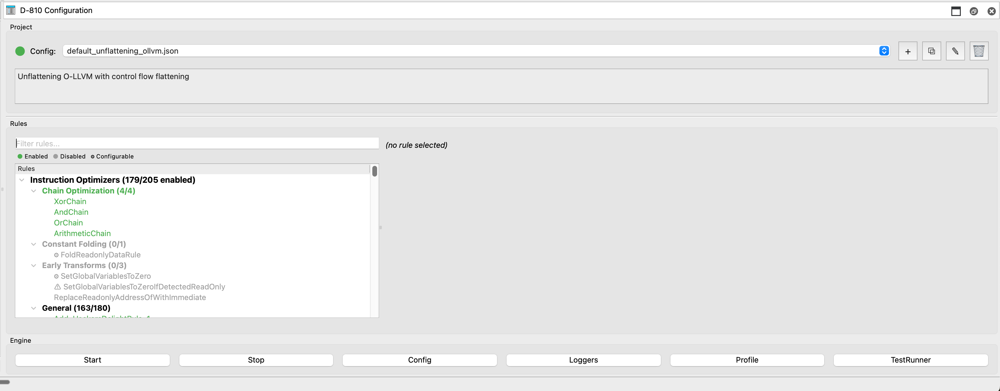

Click on a rule to see more information about it:

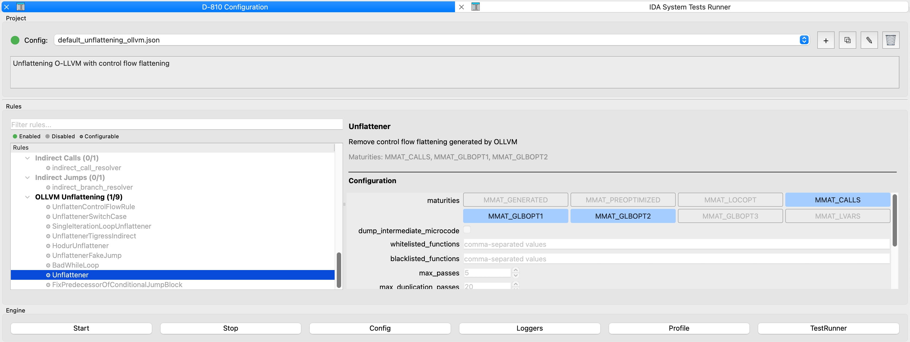

## Features Overview

### Instruction-Level Optimizations

D-810 operates on IDA Hex-Rays microcode at multiple maturity levels. Instruction rules simplify obfuscated expressions before and during decompilation.

| Category | Rules | Description |
|----------|-------|-------------|
| **MBA (Mixed Boolean-Arithmetic)** | `Add`, `Sub`, `Mul`, `And`, `Or`, `Xor`, `Bnot`, `Neg`, `Mov` | Simplifies MBA-obfuscated expressions (e.g. `(a+b)-2*(a&b) => a^b`). Z3-verified DSL rules in `d810/mba/rules/`. |
| **Hacker's Delight** | `Add_HackersDelight*`, `And_HackersDelight*`, etc. | Bit-twiddling equivalences from Hacker's Delight. |
| **O-LLVM patterns** | `Add_OllvmRule_*`, `And_OllvmRule_*`, `Or_OllvmRule_1` | Obfuscator-LLVM-specific MBA patterns. |
| **Constant folding** | `CstSimplificationRule1–22` | Arithmetic and logical constant simplifications. |
| **Predicate simplifications** | `Pred0Rule*`, `PredFFRule*`, `PredSetzRule*`, `PredSetnzRule*` | Opaque predicate removal, setz/setnz/lnot/smod simplification. |
| **Factor rules** | `AndBnot_FactorRule_*`, `Xor_FactorRule_*`, etc. | Algebraic factorization and rewriting. |
| **Chain rules** | `AndChain`, `OrChain`, `XorChain`, `ArithmeticChain` | Simplifies chains of the same operation. |
| **Z3 rules** | `Z3ConstantOptimization`, `Z3setzRuleGeneric`, `Z3SmodRuleGeneric`, etc. | SMT-based simplification when template matching fails. |
| **Constants** | **Simplify constants** (`constant-simplification`) | Resolves safe constant-memory reads, folds constant expressions, then propagates values through the function. |
| **Hodur-specific** | `Xor_Hodur_1`, `Bnot_Hodur_1`, `Or_Hodur_1`, `Or_Hodur_2` | MBA patterns seen in Hodur (PlugX) malware. |

### Control-Flow Unflatteners

Flow optimizers restore natural control flow from flattened dispatchers. The current unflattening path is engine-profile based: preanalysis produces dispatcher/value-flow evidence, cfg plans typed graph modifications, and Hex-Rays materializes the plan.

| Engine rule | Target | Description |
|-------------|--------|-------------|
| **StateMachineCffUnflattener** | OLLVM / Tigress / Approov / Hodur dispatchers | The dispatcher unflattener (a `ComposedUnflatteningRule`). Config-v2 profiles select its per-obfuscator strategy/profile — equality-chain, switch-table, indirect-transfer, and dynamic state-machine shapes. |
| **SimpleFlatteningCleanupUnflattener** | Generic cleanup | Shared cleanup family for fake jumps, single-iteration loops, bad-while-loop shapes, and predecessor branch-arm repairs. |

### Flow Optimizations (non-unflattening)

| Rule | Description |
|------|-------------|
| **JumpFixer** | Resolves opaque/constant-condition jumps (``JnzRule*``, ``JbRule1``, ``JaeRule1``, ``CompareConstantRule*``, ``JmpRuleZ3Const``). |
| **Simplify constants** | The public constant operation. Its private stages share one architecture-neutral constness oracle, so users do not choose among memory folding, subtree folding, and forward propagation rules. |

`constant-simplification` defaults to `memory_policy: "strict"`. The opt-in
`aggressive_no_direct_writes` policy also accepts writable data items with no
observed direct write, but does not prove immutability. The advanced
`allow_executable_readonly` option is a **VERY DANGEROUS** force operation that
may treat code or unresolved bytes in executable read-only memory as constant
data. It is disabled by default and has identical semantics on Mach-O, ELF,
PE/COFF, and raw binaries.

### Supported Obfuscators / Patterns

| Obfuscator | Config | Engine path | Notes |
|------------|--------|-------------|-------|
| O-LLVM (obfuscator-llvm) | `default_unflattening_ollvm.json` | `StateMachineCffUnflattener` | FLA + BCF + MBA through the OLLVM dispatcher profile. |
| Tigress switch | `default_unflattening_tigress_engine_transition_facts.json` | `StateMachineCffUnflattener` | Switch-table state dispatcher and transition facts. |
| Approov | `default_unflattening_approov.json` | `StateMachineCffUnflattener` / `SimpleFlatteningCleanupUnflattener` | Approov-like state constants and cleanup shapes. |
| Hodur (PlugX) | `example_hodur.json` | `StateMachineCffUnflattener` | Hodur MBA + Hodur while-loop state-machine recovery. |
| Tigress indirect | `default_unflattening_tigress_indirect.json` | `StateMachineCffUnflattener` | Indirect transfer-map profile with materialized target proof. |

### DSL and Rule Verification

Adding new MBA rules is straightforward: define a pattern and replacement in pure symbolic form. No manual proofs, no IDA coupling at definition time. Rules are backend-agnostic; the same DSL tree is converted to Z3 for proving and to IDA AstNode for matching. The abstraction stays clean: `d810.mba.dsl` and `d810.mba.verifier` have no IDA or Z3 imports at the rule-definition level.

**Adding a rule:** subclass `VerifiableRule`, set `PATTERN` and `REPLACEMENT`. Registration and verification are automatic.

```python
from d810.mba.dsl import Var
from d810.mba.rules import VerifiableRule

x, y = Var("x_0"), Var("x_1")

class Xor_HackersDelightRule_1(VerifiableRule):
    PATTERN = (x | y) - (x & y)
    REPLACEMENT = x ^ y
    DESCRIPTION = "Simplify (x | y) - (x & y) to x ^ y"
```

**Correctness by construction:** `verify_rule()` proves `PATTERN` and `REPLACEMENT` equivalent via the Z3 backend. If verification fails, Z3 returns a counterexample. Tests parametrize over all registered rules, so new rules are verified automatically.

**Extensible constraints:** Constraints are declarative and backend-agnostic. The `VerificationEngine` protocol is provider-neutral, and core ships the Z3 provider. Egglog rule analysis and execution are owned by the optional `d810-egglog` extension, so Egglog is not a core dependency. Constraint forms include:

Install the optional e-graph provider through the convenience extra when that
backend is needed:

```bash
python -m pip install "d810-ng[egraph]"
```

This extra resolves the separately packaged `d810-egglog` provider; the core
distribution itself has no Egglog or cloudpickle runtime dependency.
Projects select the backend-neutral `mba-egraph` pass. The installed provider
declares its concrete `EgglogOptimizer` implementation through the
`d810.backends` entry-point group and is probed before that rule is imported.

* Declarative `ConstraintExpr` (e.g. `bnot_x == ~x`, `c_minus_2 == Const("-2", -2)`)
* Runtime predicates (`when.equal_mops`, `when.is_bnot`) for IDA-specific checks; optionally attach additional backends for verification.
* Per-backend overrides via `get_constraints()` when a rule needs solver-specific logic.

Rules marked `SKIP_VERIFICATION = True` (e.g. microcode-type checks or very slow Z3 cases) are exempt but must be documented.

### Pass execution stages and maturity

Config-v2 exposes ordered passes, typed pass options, and stable transforms.
Each pass owns one or more execution stages that declare their Hex-Rays
maturities. Stage identities drive scheduling and diagnostics; private
optimizer classes are implementation details, not project selectors.

#### Maturity Levels

| Constant | Value | Description |
|----------|-------|-------------|
| `MMAT_PREOPTIMIZED` | 2 | Raw microcode, before IDA's optimizer |
| `MMAT_LOCOPT` | 3 | After local optimization |
| `MMAT_CALLS` | 4 | After call analysis |
| `MMAT_GLBOPT1` | 5 | After global optimization pass 1 |

The pass registry owns these maturity declarations. Function targeting uses a
pass entry's typed `target` object (`include_eas`, `exclude_eas`, `tags_any`,
and `tags_all`). Ephemeral preanalysis may suppress a stable stage, but there is
no durable per-function implementation-class override.

## Architecture

### The deobfuscation pipeline

D-810 ng implements a strictly isolated, uni-directional workflow for
microcode transformations. Diagnostics mirror the observations emitted by
that workflow, but they are not part of the behavioral data path. Keeping
these layers decoupled is critical for portability, safe live decompilation
reasoners, and verifiable mutations:

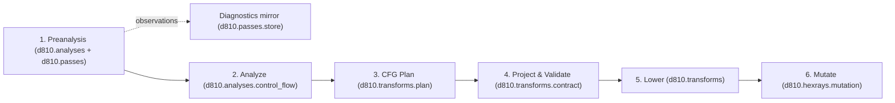
```mermaid
graph LR
    Preanalysis["1. Preanalysis (d810.analyses + d810.passes)"]
    Diagnostics["Diagnostics mirror (d810.passes.store)"]
    Analyze["2. Analyze (d810.analyses.control_flow)"]
    Plan["3. CFG Plan (d810.transforms.plan)"]
    Project["4. Project & Validate (d810.transforms.contract)"]
    Lower["5. Lower (d810.transforms)"]
    Mutate["6. Mutate (d810.hexrays.mutation)"]

    Preanalysis --> Analyze
    Preanalysis -. observations .-> Diagnostics
    Analyze --> Plan
    Plan --> Project
    Project --> Lower
    Lower --> Mutate
```

> Package note: the read-only/planning/lowering layers below were restructured
> into the LLVM/LiSA-style portable taxonomy (`preanalysis`/`cfg` were
> dissolved into `analyses`/`transforms`/`passes`/`ir`).

1. **Preanalysis Facts (`d810.analyses` collectors + `d810.passes` orchestration)**:
   A read-only, backend-agnostic pre-analysis layer. It extracts topological facts, conditional control flow shapes, entry/return frontiers, and value-flow evidence from the raw microcode using `Collector` classes (`d810.analyses.value_flow` / `d810.analyses.control_flow`), orchestrated by `d810.passes`. Live IDA/Hex-Rays decompilation dependencies are strictly isolated. Observations needed by later passes remain in the current function's in-memory `AnalysisManager` session.
2. **Analyze Facts (`d810.analyses.control_flow`)**:
   Topological and state-machine discovery engines consume the current in-memory facts in pure Python. They resolve condition-chain intervals, model state variable paths, and detect dispatcher boundaries.
3. **CFG Flow Graph Planning (`d810.transforms.plan`)**:
   Generates a backend-neutral graph modification strategy (`PatchPlan`, `GraphModification`). These plans represent control-flow changes (e.g. unflattening, conditional splits, predecessor branch repairs) purely in topological form.
4. **Project Modifications & Validation (`d810.transforms.contract` + `d810.hexrays.contracts`)**:
   The planning output is audited for structural validity, semantic reference consistency, and target-entry admission constraints prior to mutation.
5. **Lower Projections (`d810.transforms`)**:
   Translates validated abstract modifications into backend-specific lower-level instructions and edge routing instructions.
6. **Lowering to Mutations (`d810.hexrays.mutation`)**:
   The final materialization backend transforms Hex-Rays microcode. By architecture policy (enforced via `no-direct-hexrays-mutation-outside-deferred-modifier.yml`), mutators must queue rewrites via `DeferredGraphModifier` (e.g. NOP blocks, successor modifications). This layer owns invalidation, stale pointer tracking, `MBL_KEEP` preservation, and transactional safety/rollbacks.

The diagnostics store is an asynchronous observer of this pipeline. It can
persist facts, lifecycle events, and mutation provenance for inspection, but
behavior code does not query SQLite to decide what to rewrite.

### Native-bound in-memory observations

Hex-Rays can renumber or replace microcode blocks between maturity snapshots,
so a block serial observed during preanalysis is not a safe identity for a
later mutation. D-810 solves this without turning the diagnostic database into
a behavior dependency:

1. A producer records the relevant source and target native instruction EAs,
   along with the snapshot-local serials and topology that explain the
   observation.
2. The observation is retained in the current function's in-memory
   `AnalysisManager` session. Graph-keyed analysis caches may be invalidated,
   but these session observations survive for later passes in the same
   decompilation.
3. At the consuming maturity, both native EAs must bind uniquely to blocks in
   the current graph. Recorded serials remain provenance only; they never
   become current authority.
4. The rebound route must agree with the current state carrier, dispatcher
   topology, and any concrete router result. Agreement strengthens a heuristic
   candidate into an actionable route. A malformed observation, conflicting
   native target, ambiguous binding, or contradictory current route invalidates
   the candidate and D-810 abstains.
5. A `native-bound transition route receipt` is emitted only after the backend
   reports a changed graph and the route's operation key appears exactly once
   in the committed mutation inventory.

This is deliberately stronger than treating observations as hints and narrower
than treating them as timeless proof. Native identity carries evidence across
maturities; the current graph decides whether that evidence is still coherent.
The diagnostic SQLite database may mirror the same events for inspection, but
it is never queried as the authority for the rewrite.

The committed MASM acceptance fixture
[`Eid_ShowErrorAndTerminateProcess.asm`](samples/src/masm/Eid_ShowErrorAndTerminateProcess.asm)
exercises two such routes and
[`test_native_bound_transition_routes.py`](tests/system/e2e/test_native_bound_transition_routes.py)
requires one mutation-coupled receipt for each recovered edge.

---

### Lift → Transform → Lower: the round-trip (and why it is not just LLVM / LiSA)

The pipeline above is uni-directional, but the *system* it lives inside is a **round-trip against a live, still-optimizing Hex-Rays**: D-810 lifts the live microcode into a portable snapshot IR, runs portable analyses/transforms that emit declarative modification *intents*, then lowers those intents back into the same `mba_t` — which Hex-Rays keeps optimizing afterwards. That round-trip is the hard, partially-novel part, and finishing the portable-IR convergence is the project's central open problem (ticket `llr-lxas`).

It helps to see it as **two IRs sharing one substrate**:

* The **analysis IR** (lift → run abstract domains) is LLVM / LiSA / VEX territory — lift to a typed, def-use-style representation and run fixpoints. Largely copyable.
* The **rewrite IR** (transform → lower → write back) is **GTIRB / refactoring-CST** territory (libcst, Roslyn). The value is the *round-trip*: edit, then render back to a valid artifact, preserving everything you did not touch. LLVM never renders back to C; angr never writes VEX back to bytes.

D-810 is the union of both — and adds a third property neither has: **the artifact you write back keeps getting optimized after you let go of it** (Hex-Rays runs `optimize_global`/DCE on your output).

#### The four hard sub-problems

1. **Semantic lift fidelity.** Topology is already portable (`FlowGraph`/`BlockSnapshot`). Operands are not: `InsnSnapshot` carries portable abstractions (`kind: InsnKind`, `branch_predicate`) but its operands are still `l`/`r`/`d` `MopSnapshot`s — Hex-Rays operand-position taxonomy with decoded values — and nested expression trees are flattened to `stack_refs` (lossy). A portable Operation/Value/Location substrate exists (`d810.ir.{expressions,value_refs,locations,semantics}`, LLVM/LiSA-style) but is **not yet wired into the lift**. The lift is allowed to be lossy — analysis only needs what it queries.
2. **Inverse semantics — lowering must be *total and valid*.** You can drop detail going in; you cannot going out. D-810's escape hatch: it lowers by **replaying captured live bodies** (`hexrays.mutation.insn_snapshot_materializer` + `CapturedBlockBody` + a Hex-Rays `mop_t` clone), *not* by codegen from the portable IR — so it never needs a full microcode emitter. This is why the intent vocabulary in `transforms/graph_modification.py` is kept almost entirely **structural** (`RedirectGoto`, `RedirectBranch`, `ConvertToGoto`, `InsertBlock`, `RemoveEdge`, `NopInstructions`, `DuplicateBlock`, …); the handful that *synthesize* a value (`ZeroStateWrite`, `PromoteOperandToScalar`, `LowerConditionalStateTransition`) are exactly the fragile/dormant ones. Holding the structural-only line is the single biggest tractability lever.
3. **Anchored provenance + transactional apply.** Intents reference *anchors* (block serials, instruction EAs, operand identity — `d810.ir.{handles,provenance,block_identity,mop_identity}`), never live pointers, because applying edit N invalidates the identities edit N+1 named. `DeferredGraphModifier` queues edits and re-resolves anchors at apply time; `cfg_verify` re-validates; stale-pointer tracking and rollback live here. Anchor stability under mutation is the irreducibly fiddly part.
4. **Survival — the property no analysis IR has.** Edits lowered at maturity *M* must survive Hex-Rays's own later passes (`optimize_global`/DCE). They must be *sticky* (`MBL_KEEP`, `transforms/mbl_keep_selection.py`) and semantically robust enough not to be undone.

#### The contract that holds it together

* **Lift** = `hexrays.mutation.ir_translator.lift(mba) -> FlowGraph` (backend-owned): syntax + (partial) semantics + provenance, as an immutable snapshot.
* **Transform** = pure `(portable IR) -> declarative intents` referencing anchors (`d810.analyses` + `d810.transforms`).
* **Lower + Mutate** = backend resolves anchors → live mutations transactionally, owning *all* validity/survival concerns (`d810.hexrays.mutation`).
* **Invariant**: the live `mba_t` enters portable-core *only* via lift and exits *only* via lower. Where this is currently violated — a live handle still threaded into portable analyses behind the `BstWalkerProvider` seam / `_FlowGraphMBAView` adapter — is the concrete `llr-zeyu`/`llr-lxas` debt.

#### Where the convergence actually stands

| surface | portable today | still Hex-Rays-shaped | convergence gap (`llr-lxas`) |
|-|-|-|-|
| **Lift** (`ir`, `hexrays.mutation.ir_translator`) | topology; `InsnKind`, single `PredicateKind`; anchors (ea/serial/handles); statement projection (`Assignment` / `ConditionalBranch` over `ir.{expressions,value_refs,locations}`) for the MOV + conditional-jump families via `ir.insn_projection`; nested `mop_d` lifted to nested `ExprRef` (`Add`/`Sub`/`And`) | `InsnSnapshot.{l,r,d}`, `opcode`, `display_text`; unmapped nested ops (`or`/`xor`/`shl`/…) still flattened | extend the projection + nested-op families on demand; retire `l/r/d` |
| **Transform** (`analyses`, `transforms`) | declarative intents (`graph_modification.py`), mostly structural | a live handle still leaks via the seam/view | finish the anchored semantic lift so analyses stop needing the live shape |
| **Lower** (`hexrays.mutation`) | `DeferredGraphModifier`, `cfg_verify`, anchor re-resolution, `MBL_KEEP` | lowering replays captured `mop_t` clones, not portable codegen | only needed if transforms must *synthesize* computation — defer |

Pragmatic sequencing: keep lowering structural-only, and retire `l/r/d` **incrementally, driven by what each analysis actually needs** — each analysis that stops needing the live operand shape is one fewer reason for the seam/view to exist. A green data-model gate means the live method-*calls* left portable-core text, **not** that the IR converged.

#### Identity vs. expression: an audited boundary (`llr-lxas`)

A recurring temptation when promoting the statement nodes is to let `ConditionalBranch.lhs` (the compared operand, an *expression*) double as the **identity key** the dispatcher / state-machine readers use to group comparisons by variable. It must not. Identity and expression are **separate layers**: `d810.ir.mop_identity.mop_snapshot_key` — a size-*agnostic*, kind-prefixed key (`S{stkoff}` / `r{reg}` / `v{gaddr}` / `l{lvar_off}`) — is the LiSA *Identifier* / LLVM `Value`-identity / VEX guest-offset; `ConditionalBranch.lhs` is the syntactic operand expression. `mop_snapshot_key` is already vendor-free, so swapping it in for a size-aware `DefinitionRef(StackSlot(off, size))` pays no portability debt and only introduces regressions.

This was settled **empirically, not by argument**. A `--full-diagnostics` dump writes a per-decompilation SQLite snapshot DB whose `instructions` table carries every captured operand's kind / offset / size, so the claim is queryable:

```bash
# 1. capture the diag DB (per function; MMAT snapshots + the D810 stages)
PYTHONPATH=src python3 tools/d810cli.py dump -w <wt> \
  -f sub_7FFD3338C040 -p hodur_flag2.json --full-diagnostics
DB=$(ls -t .tmp/logs/d810_logs/*.diag.sqlite3 | head -1)

# 2. SIZE SENSITIVITY — stack slots written at more than one width
sqlite3 "$DB" "SELECT COUNT(*) FROM (SELECT dest_stkoff FROM instructions
  WHERE dest_stkoff IS NOT NULL GROUP BY dest_stkoff
  HAVING COUNT(DISTINCT dest_size) > 1)"            # -> 132  (of 256 slots = 52%)

# 3. KIND COVERAGE — operand kind of the compared variable in conditional jumps
#    (opcode 42..52 = m_jcnd..m_jle; mopt 1=reg 4=sub-insn/nested 5=stack 9=lvar)
sqlite3 "$DB" "SELECT src_l_type, COUNT(*) FROM instructions
  WHERE opcode BETWEEN 42 AND 52 GROUP BY src_l_type"
  # -> mop_S 1668 | mop_d 96 (nested) | mop_l 16 (lvar) | mop_r 10
```

The two measured findings that kill the swap:

* **Size sensitivity.** **132 of 256 stack slots (52%)** are written at more than one width (8 / 4 / 1 bytes — the `m_xdu` widening / sub-register access pattern). `mop_snapshot_key` keys `S{stkoff}` and treats a slot as one variable (correct); `DefinitionRef(StackSlot(off, size))` is size-aware and would split a single dispatcher state-variable into two or three.
* **Kind coverage.** The compared operand is `mop_l` (lvar) 16× and `mop_d` (nested sub-instruction) 96×. `mop_snapshot_key` keys lvar; the size-aware location projection represents neither (→ `None` → dropped comparisons).

Verdict: identity grouping **keeps** `mop_snapshot_key`; `ConditionalBranch` carries operands as expressions for value/structure analyses only — complementary layers, not redundant. The one genuine operand-lift this surfaced is the **96 nested `mop_d` compared operands** (4 even at GLBOPT1): lift those into nested `ExprRef` (`Add`/`Sub`/`And`/…) when an analysis needs the compared-expression *structure*, which is distinct from — and does not touch — the identity grouping.

---

### Analysis and Mutation Boundaries

D-810 enforces strict boundaries to keep code clean and testable:

#### `d810.analyses`
* **Role**: **Read-only pre-analysis** (the dissolved `d810.preanalysis` discovery/fact layer now lives here as `d810.analyses.control_flow` / `d810.analyses.value_flow`).
* **Allowed**: Collecting CFG shapes, return frontiers, and value-flow evidence.
* **Forbidden**: Direct imports of `d810.hexrays` or live mutation code. Do not put live `mba_t` value tracking logic inside the portable analyses layer.

#### `d810.evaluator.hexrays_microcode`
* **Role**: **Live proof**.
* **Allowed**: Inspecting active `mba_t`, `mblock_t`, `minsn_t` chains, use/def lists, and tracking registers.
* **Forbidden**: Writing or pruning microcode instructions or modifying the CFG.

#### `d810.hexrays.mutation`
* **Role**: **Central Mutation Backend**.
* **Allowed**: Materializing plans, rewriting instruction blocks, clearing lists, and executing deferred updates.
* **Forbidden**: Direct inline mutations inside read-only analysis loops; all edits must route through the `DeferredGraphModifier`.

---

### Read-Only Hex-Rays Safety Policy

Read-only proof modules may inspect live Hex-Rays state, but they must not mutate it.

* **Allowed in evaluator/read-only proof**: `mba.build_graph()`, `mba.get_graph()`, `mblock_t.make_lists_ready()`, `mblock_t.build_use_list()`, `mblock_t.build_def_list()`, dominator/postdominator queries.
* **Not allowed in read-only proof**: `mblock_t.build_lists(kill_deads=True)`, `mba.mark_chains_dirty()`, block/instruction deletion or replacement.

The practical rule is:
1. If it must be portable/serializable, put it in the portable core (`d810.analyses` / `d810.transforms` / `d810.ir`).
2. If it requires live Hex-Rays value-flow reasoning, put it in `d810.evaluator`.
3. If it modifies CFGs or instructions, put it in `d810.hexrays.mutation`.


### Unflattening Family Selection: Dispatcher Shape, Not Vendor

The §1a control-flow unflattener (`StateMachineCffUnflattener`) does **not** classify functions by *which obfuscator produced them*. It detects the **structure** of the flattening dispatcher and routes accordingly. This matters for contributors: you almost never need to "know the family" to add coverage.

**How routing works.** At `MMAT_GLBOPT1` the rule lifts the function to a portable `FlowGraph`, then `families.registry.select_family(graph, project_config)` polls the registered `StateMachineCffFamily` *profiles* and returns the first whose `detect()` claims the graph. The claiming profile's `pipeline_for()` drives the shared five-pass spine through `run_pipeline`.

**Detection is structural.** Each profile's `detect()` recognizes a dispatcher *shape* — a state variable + a dispatch mechanism + handlers that write the next state — via the ranked `DispatcherResolver` chain (`analyses/control_flow/dispatcher_resolver.py`). None of them check a vendor signature. The profile names are shape labels:

| Profile | Dispatcher shape |
|-|-|
| `HodurFamily` | equality-chain (`CONDITIONAL_CHAIN`) |
| `ApproovFamily` / `TigressFamily` | switch-table / indirect |

So an unknown obfuscator that flattens with, say, an equality-chain dispatcher is handled by `HodurFamily` because it matches the *structure* — not because it is "Hodur."

**What happens with an unknown obfuscator:**

| Case | Behavior |
|-|-|
| Unknown vendor, **known shape** (the common case) | Handled by the structural detector; no config or vendor knowledge needed. |
| Known vendor, want precision | The optional `router_resolution` config override (below) directs selection. |
| Unknown vendor **and** unknown shape | `profile_classifier` returns `DispatchPattern.UNKNOWN` → conservative handling (attempt redirects only on strong structural signals). With no matching detector, `select_family` returns `None` → no unflatten. |

**Extending it (for contributors):**

1. **New dispatcher shape** — add a `DispatcherResolver` (`accepts` / `resolve`) to the chain. Every consumer (`select_family`, all profiles) picks it up; no vendor tagging anywhere.
2. **New vendor needing shape-specific recovery** — add a `StateMachineCffFamily` profile under `families/state_machine_cff/<name>.py`: a `detect` (claim by `DispatcherType` + any signature) and a kind-aware `pipeline_for`. Register it via the package `__init__` eager import.
3. **Config-directed routing** — set `router_resolution` in the `StateMachineCffUnflattener` rule config: `require` (force one profile), `prefer` (bias the order), `deny` (exclude). Absent it, pure shape-detection runs.

> Naming caveat: the *emulated-dispatcher* strategy (`emulated_dispatcher_strategy.py`, which feeds the static `CFFStrategyFamily`) recovers VM / switch dispatchers *statically* — it does **not** use the concolic emulator despite the "emulated" name. It is subsumed by the §1a `StateMachineCffUnflattener` profiles above; the concolic `EmulationCapability` handles the genuinely-needs-execution indirect-jump cases.


## Installation

**D-810 ng supports IDA 9 or later with Python 3.11 or later.**

There are two supported installation paths: a managed HCLI installation for
normal use, or an editable source checkout for development.

### Install with HCLI

Use the normal plugin-repository path:

```bash
hcli plugin install d810-ng
```

HCLI reads `ida-plugin.json`, selects the exact `d810-ng==<plugin version>`
wheel for IDA's Python ABI and the host platform, and installs that wheel into
IDA's Python environment. The selected wheel already contains D-810's
compiled native speedups, so the HCLI path requires neither a compiler nor the
IDA SDK. See [D-810 ng in the Hex-Rays Plugin Repository](https://plugins.hex-rays.com/w00tzenheimer/d810-ng)
and the official [HCLI plugin documentation](https://hcli.docs.hex-rays.com/getting-started/quick-start/)
for HCLI setup and plugin-management commands.

If no compatible wheel exists for the current platform and ABI, installation
must fail clearly. It must not fall back to a pure-Python package while
claiming native support. Restart IDA after installation or upgrade.

For an HCLI wheel installation, the optional bootstrap only verifies the
bundled native modules in a fresh process and provisions isolated Z3 support
where configured:

```bash
IDA_PYTHON=/path/to/ida-pro/python_standalone/bin/python3
"$IDA_PYTHON" -m d810.speedups.install
```

Run this command with IDA's Python, not a system Python. It does not recompile
an immutable installed wheel. If solver support is installed or changes,
restart IDA before using D-810.

The local Docker installation proof covers one target only: Linux ARM64,
CPython 3.13, and IDA 9.4. The release matrix remains responsible for Linux
x86-64, Windows x86-64, macOS x86-64, macOS ARM64, and CPython 3.11 through
3.13.

### Install from source

Use an editable installation when developing D-810 ng or tracking a repository
branch. Clone or symlink the checkout under IDA's user plugin directory:

```text
~/.idapro/plugins/d810-ng/                         # macOS and Linux
%APPDATA%\Hex-Rays\IDA Pro\plugins\d810-ng\       # Windows
```

Then use the Python interpreter configured for IDAPython:

```bash
python -m pip install -e .
python -m d810.speedups.install
```

The speedup bootstrap discovers the IDA SDK and local IDA installation, builds
native extensions for the editable checkout, installs isolated Z3 support
where configured, and performs a fresh-process ABI/load verification. It
requires an IDA restart after rebuilding. The SDK is auto-downloaded when it
is not available; set `IDA_SDK=/path/to/ida-sdk` to use a local SDK explicitly.

D-810 includes optional [Cython](https://cython.org) extensions for
performance-critical paths. Every native module has a pure-Python fallback,
but the editable bootstrap is the supported path for building and verifying
the native extensions.

For packaging or advanced builds, the direct form remains available:

```bash
D810_BUILD_SPEEDUPS=1 python -m pip install -e ".[speedups]" --no-build-isolation
```

To compile extensions in place without installing:

```bash
D810_BUILD_SPEEDUPS=1 python setup.py build_ext --inplace
```

#### Build inside Docker

Building inside an IDA container ensures SDK headers and symbols are available:

```bash
apt-get update && apt-get install -y g++
python -m pip install setuptools wheel "Cython>=3.0.0"
D810_BUILD_SPEEDUPS=1 python -m pip install --no-build-isolation -e ".[dev]"
```

#### Build environment variables

| Variable | Purpose | Default |
|---|---|---|
| `D810_BUILD_SPEEDUPS` | Set to `1` to compile `.pyx` files | `0` (disabled) |
| `IDA_SDK` | Path to IDA SDK directory | Auto-downloads to `.ida-sdk/` |
| `D810_SPEEDUPS_DIR` | Isolated directory for solver support | `~/.d810-speedups/` |
| `DEBUG` | Set to `1` for debug builds with profiling/tracing | `0` |
| `D810_NO_CYTHON` | Set to `1` to disable Cython at runtime | Not set (enabled) |

`--no-build-isolation` is intentional: it makes the build use the Cython
installed for the same interpreter that will load the extensions.

Speedups are generously provided by
[Mahmoud Abdelkader](https://mahmoudimus.com), who describes the approach in
["IDA Pro and Cython: Super-charging the Work-horse of Reverse Engineering"](https://mahmoudimus.com/blog/2025/08/ida-pro-and-cython-super-charging-the-work-horse-of-reverse-engineering/).

## How to use D810

1. Choose or create your project configuration. If you are not sure what to do here, leave *default_instruction_only.json*.
2. Click on the `Start` button to enable deobfuscation
3. Decompile an obfuscated function, the code should be simplified (hopefully)

### Config-v2 bundled projects

Config v2 is the only runtime schema for bundled projects. Each bundled project
contains its own typed `additional_configuration.pipeline_v2` declaration and
is loaded directly; there is no source/runtime alias or basename routing step.

The supported bundled project names are:

- `default_instruction_only.json`
- `default_unflattening_tigress_engine.json`
- `hodur_flag2.json` and `hodur_glbopt2_only.json`
- `eidolon.json` and `eidolon_v3_const_solve.json`
- `default_unflattening_approov.json` and
  `default_unflattening_approov_s1a.json`
- `hodur_flag2_s1a.json` and `hodur_flag2_with_fcp.json`
- `identity_call.json`
- `default_unflattening_tigress_engine_transition_facts.json`
- `example_libobfuscated_abc.json`, `flatfold.json`, and `example_hodur.json`
- `default_unflattening_ollvm.json`, `default_indirect_resolution.json`, and
  `default_unflattening_tigress_indirect.json`
- `default.json`, `example_libobfuscated_no_fixprecedessor.json`,
  `bogus_loops.json`, and `example_libobfuscated.json`

Fixture-only projects use stable names such as
`dead_store_elimination_fixture.json` and
`hodur_flag2_s1a_fixture_constant_simplification.json`. Research portfolios,
shape catalogues, and spike configurations remain separate data fixtures and
are not bundled runtime defaults.

To migrate an older user project offline, run:

```bash
python tools/migrations/migrate_project_config_v2.py INPUT --output OUTPUT
```

The migrator is fail-closed: it refuses unsupported rule ownership or lossy
options rather than selecting a different runtime project.

### Config-v2 validation

Config-v2 is the only runtime path for bundled configs. User-provided configs
run on the existing project configuration path unless they explicitly set
`pipeline_v2_mode: config-v2` and pass fail-closed config-v2 validation.

When you want to disable deobfuscation, just click on the `Stop` button or use the context menus:

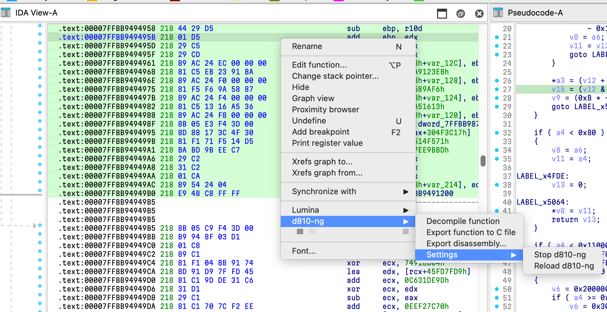
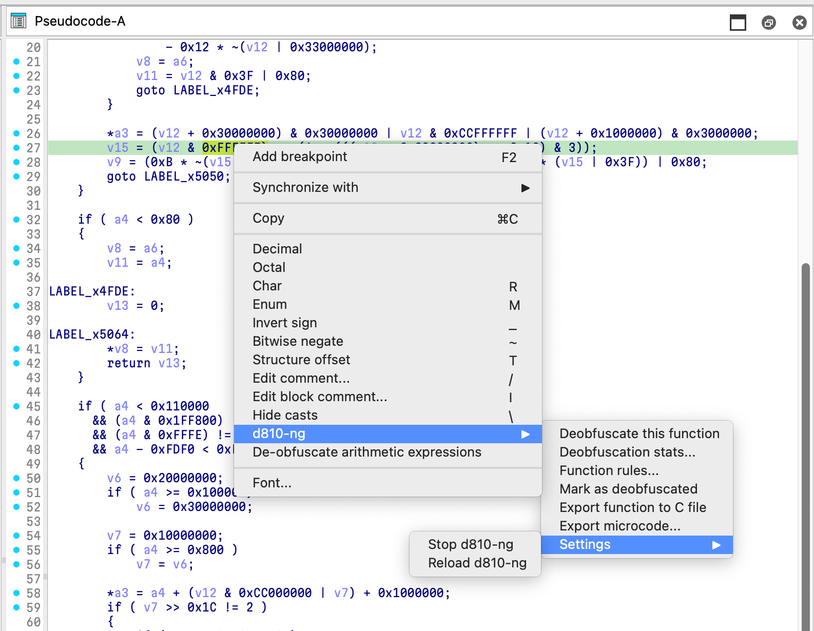

### Per-function recipes

Use the Deobfuscation Workbench's **Recipe** composer when one function needs a
different config-v2 pipeline or typed pass options. The durable action is
**Save for Deobfuscate This**. It stores public pass IDs and their options, not
private implementation-rule checkboxes.

Ordinary F5/refresh continues to use the active project runtime. The saved
function recipe runs only through **Deobfuscate This**, which installs it for
one synchronous decompile and restores the project runtime afterward. The
Workbench runtime row states this distinction and its **Effective execution**
row explains active/excluded pass stages and reason codes.

Recipes and function tags are keyed by database identity, project name, and
function address. A stored fingerprint is revalidated so changed function
bytes produce a visible stale-recipe diagnostic instead of applying uncertain
configuration.

See [docs/features/function-recipes.md](docs/features/function-recipes.md) for
the workflow, typed state-CFF threshold, persistence, and safety tradeoffs.

## How to deobfuscate something new

Before you pick a rule, understand the shape. This is the workflow, obfuscator-agnostic — you almost never need to know "which obfuscator produced this" to add coverage.

1. **Triage the shape.** Decompile the target natively first — that native decompile is your oracle. Classify what you see: MBA / arithmetic, an opaque predicate / constant-condition jump, an indirect jump / call, or control-flow flattening (a dispatcher). Use the diagnostics CLI (the *Diagnostics & CLI Tools* section below) to look at the microcode, not just the pseudocode.

2. **Pick your lever.**

   | Shape | Lever | Where |
   |-|-|-|
   | MBA / arithmetic | DSL `VerifiableRule` (pattern + replacement, Z3-verified) | `src/d810/mba/rules/` |
   | Opaque predicate / constant jump | `JumpFixer` family | `src/d810/optimizers/microcode/flow/jumps/` |
   | Indirect jump / call, table decode, custom transform | Port a `FlowOptimizationRule` (step 3) | `src/d810/optimizers/microcode/flow/` |
   | Control-flow flattening / dispatcher | `ComposedUnflatteningRule` / `StateMachineCffUnflattener` + a strategy/profile | `src/d810/optimizers/microcode/flow/flattening/` |

3. **Porting an analysis / transform pass.** To bring an external C++ (or LLVM) deobfuscation pass into d810, reimplement it as a Python `FlowOptimizationRule`: detect the pattern at the right maturity, reuse the framework helpers (e.g. `d810.hexrays.utils.table_utils` for table / xor / global analysis), mutate the microcode graph through `DeferredGraphModifier`, and validate the result with `safe_verify`. Register the rule in a config-v2 profile so it runs.

4. **Build a fixture** so your target lives in the tracked corpus and CI guards it. Two paths:
   - **Author a C source fixture** — write `samples/src/c/<name>.c`, then `make` (the *Adding New Obfuscation Examples* section below) builds it into `libobfuscated.{dll,so,dylib}`. Use this for a minimal, controlled repro of a pattern. The sample build compiles C only — there is no C++ path, and C suffices because the obfuscation lives in the compiled machine code, not the source language.
   - **Extract a real function to MASM** — `python tools/d810cli.py fixture add --idb <db.i64> --func <ea|name> --project <profile>` lifts a genuine obfuscated function from an IDB into `samples/src/masm/`, retargets its indirect calls onto named stubs, builds locally, and stops at a human gate for you to add the semantic assertions.

5. **Verify.** Add a `DeobfuscationCase` and check the deobfuscated output against the native-decompile oracle — it must copy IDA's structure, not merely differ. Then wire the rule into the config-v2 profile it belongs to.

6. **See how it applied — or where it missed.** Use the diagnostics CLI and the persistence layer (the *Diagnostics & CLI Tools* section below) to inspect which rules fired, on which blocks, and what stayed obfuscated.

## Adding New Obfuscation Examples

In `samples/src`, there are various `C` programs compiled using the `samples/Makefile` into a shared library, without optimizations (`-O0`). On Windows, that shared library is a `.dll`; on macOS, it is a `.dylib`; on Linux, it is a `.so`. Included is an example compiled DLL, `libobfuscated.dll`, that can serve as a testing ground for seeing the plugin in action. Please make a pull request with more obfuscation `C` examples to build a repository of obfuscated sample code for further research.

### Test Runner

D-810 ng comes with a built-in test runner that loads IDA runtime tests from the tests folder (primarily under `tests/system`). This GUI is a simple test runner that allows a developer to run tests *inside* of IDA Pro, accessing the hexrays decompiler API and utilizing specific samples under `samples/bins` to test transformations.

The test runner is self-explanatory:

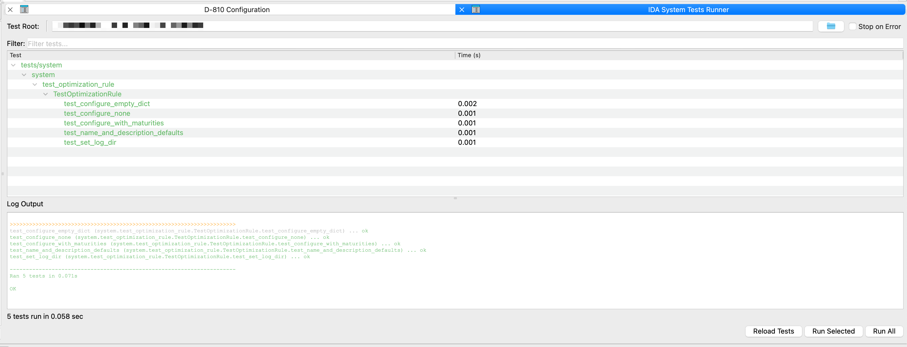

Test reloading exists without needing to restart `IDA Pro` and you can execute different part of the tests via the testing context menu:

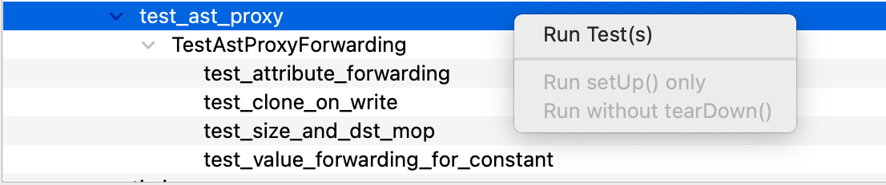

### How to build

The sample binaries are built via the `samples/Makefile`. You can cross-target OS and architecture.

* Output name:
  * default (`BINARY_NAME` untouched): `bins/<BINARY_NAME>_<hostos>_<arch>.<suffix>`
  * explicit `BINARY_NAME` (CLI/env): `bins/<BINARY_NAME>.<suffix>`
  * `<BINARY_NAME>` defaults to `libobfuscated`
  * `<hostos>` is the machine running `make` (`darwin`, `linux`, `windows`)
  * `<arch>` is normalized (`x86_64` or `arm64`)
  * `<suffix>` comes from target OS: `dll` (windows), `dylib` (darwin), `so` (linux)

Flags you can pass to `make`:

* `TARGET_OS` (default: `windows`)
  * One of: `windows`, `darwin`, `linux`, `native`
  * `native` is normalized to the detected host OS (`darwin`, `linux`, or `windows`)
* `BUILD_ARCH` (default: `x86_64`)
  * Examples: `x86_64`, `x86`, `arm64`
  * `x86` is normalized to `x86_64` (32-bit builds are not supported)
  * Also accepts explicit compiler flags (e.g., `-m64`, `-arch arm64`)
* `BINARY_NAME` (default: `libobfuscated`)

Notes:

* Builds are unoptimized by default: `-O0 -g` and inlining/vectorization are disabled.
* On non-Linux hosts, `TARGET_OS=linux` automatically uses Docker to produce true ELF output.
* Linux Docker build selects platform from `BUILD_ARCH`:
  * `x86_64` -> `linux/amd64`
  * `arm64` -> `linux/arm64`
* On non-Windows hosts, `TARGET_OS=windows` uses Docker when no explicit Windows sysroot/toolchain is provided.

Examples (run from the repo root):

```bash
# Build defaults: Windows DLL (name includes host+arch by default)
cd samples && make
# → bins/libobfuscated_<hostos>_x86_64.dll

# Build Linux .so for x86_64 ELF
make TARGET_OS=linux BUILD_ARCH=x86_64
# → bins/libobfuscated_<hostos>_x86_64.so

# Build Linux .so for arm64 ELF
make TARGET_OS=linux BUILD_ARCH=arm64
# → bins/libobfuscated_<hostos>_arm64.so

# Build macOS .dylib for x86_64
make TARGET_OS=darwin BUILD_ARCH=x86_64
# → bins/libobfuscated_<hostos>_x86_64.dylib

# Build for the native host OS (x86 maps to x86_64)
make TARGET_OS=native BUILD_ARCH=x86
# → bins/libobfuscated_<hostos>_x86_64.<ext>

# Customize binary name
make BINARY_NAME=libobfuscatedv2
# → bins/libobfuscatedv2.dll (or .so/.dylib based on TARGET_OS)

# Clean artifacts
make clean
```

### Test Constant Simplifications

**Before**: 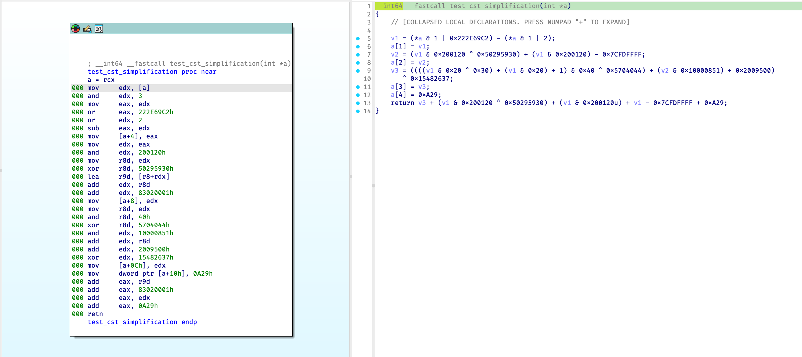

**After**: 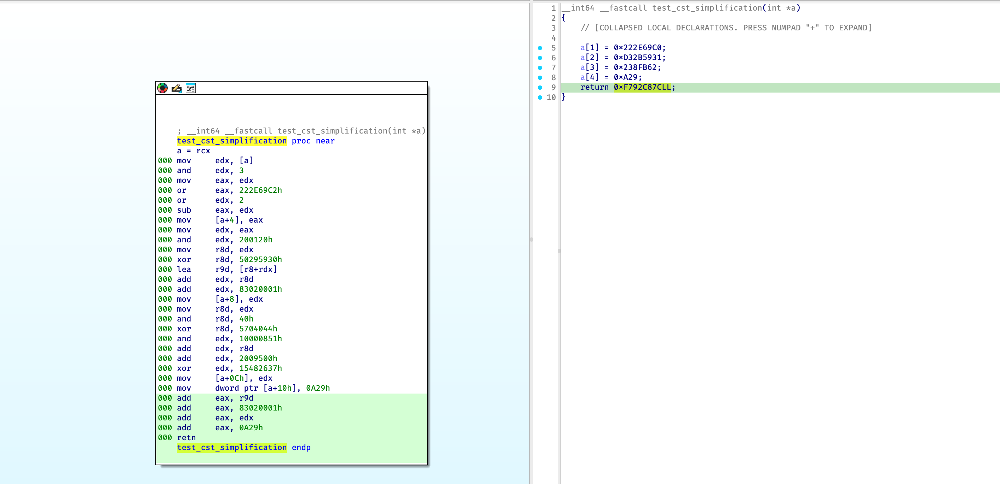

### Test XOR Simplifications

**Before**: 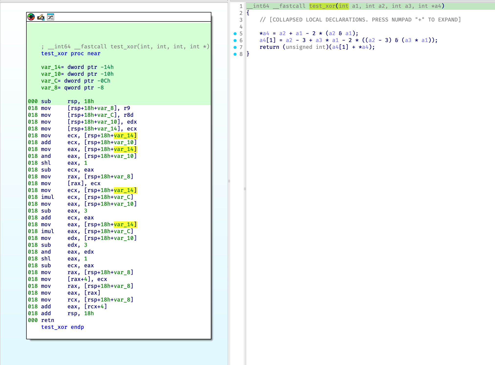

**After**: 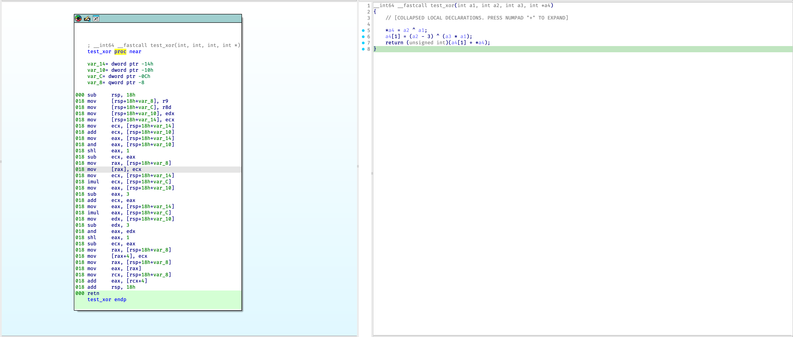

## Diagnostics & CLI Tools

D-810 ng has a dedicated operator CLI tool, `tools/d810cli.py`, which is the official interface for deobfuscation dumps, diagnostic queries, and offline program analysis. This CLI completely wraps the Docker-based runner and local environment setup.

### Official Workflow (Preferred)

#### 1. Create a deobfuscation dump
Use the `dump` command. It triggers decompilation of the target function, saves a text dump, and persists a diagnostic SQLite DB under `.worktrees/<worktree>/.tmp/`:

```bash
# Running a quick dump on the default function (sub_7FFD3338C040)
PYTHONPATH=src python3 tools/d810cli.py dump --label quick
```

#### 2. Inspect pseudocode and statistics
Inspect the latest generated dump's AFTER pseudocode and delta stats:

```bash
# View AFTER decompiled pseudocode with line numbers and optimization metrics
PYTHONPATH=src python3 tools/d810cli.py after -n --stats
```

### Useful CLI Commands

* **Show artifact paths**: `PYTHONPATH=src python3 tools/d810cli.py paths`
* **Deobfuscation Stats**: `PYTHONPATH=src python3 tools/d810cli.py stats`
* **Frontier Diagnostics**: `PYTHONPATH=src python3 tools/d810cli.py frontier-diagnostics`
* **Terminal Byte Audit**: `PYTHONPATH=src python3 tools/d810cli.py byte-audit`

### Offline Diagnostic DB Queries

You can run diagnostic and trace queries on the generated SQLite databases using your local environment without launching an IDA instance.

```bash
# Resolve the latest diagnostic DB path for a worktree
# (substitute your worktree name; omit the .worktrees/${WORKTREE_NAME}/ prefix
# for the root checkout)
WORKTREE_NAME=<your-worktree-name>
DB=$(ls -lhS .worktrees/${WORKTREE_NAME}/.tmp/logs/d810_logs/*.diag.sqlite3 | head -1 | awk '{print $NF}')

# List all captured snapshots
sqlite3 $DB "SELECT id, label FROM snapshots"

# Trace specific microcode instructions or EAs across snapshots
PYTHONPATH=src python3 -m d810.diagnostics ea-trace --db $DB 0x1800134A5

# Structured queries: a block chain, writes to a stack slot, return-path hops
PYTHONPATH=src python3 -m d810.diagnostics chain --db $DB 131 174 176
PYTHONPATH=src python3 -m d810.diagnostics var-writes --db $DB 0x7F0
PYTHONPATH=src python3 -m d810.diagnostics return-paths --db $DB
```

Run `PYTHONPATH=src python3 -m d810.diagnostics --help` for the full set of query subcommands.

### Cross-session persistence

Beyond the per-run diagnostic snapshots, D-810 keeps persistent optimization
results plus database/project-scoped function recipes and tags. The safe
default backend is IDB-local netnode storage; an explicitly configured SQLite
backend can be shared without colliding same-address functions from different
databases. SQLite is activated by saving the typed `function_recipe_storage`
setting with `backend: sqlite` and an explicit absolute `path` outside the log
directory; the manager switches backends immediately without a restart.

---

## Running Tests

### Unit Tests

Unit tests are pure-Python and run rapidly without requiring an active IDA Pro database. Execute them from the repository root:

```bash
PYTHONPATH=src:tests pyenv exec python -m pytest tests/unit/ -v --tb=short -x
```

### System & E2E Tests (Headless IDA)

D-810 ng has a comprehensive integration/system test suite that runs inside headless IDA Pro (`idalib`). These tests run within local Docker containers containing pre-configured IDA instances.

**Prerequisites**:
* Docker and Docker Compose
* Access to `ghcr.io/w00tzenheimer/idapro-linux` images

#### Run all System/E2E Tests:
```bash
docker compose run --rm --entrypoint bash idapro-tests-9.2 -c \
  "pip install -e .[dev] -q && pytest tests/system/ -v --tb=short"
```

#### Run a specific E2E test file:
```bash
docker compose run --rm --entrypoint bash idapro-tests-9.2 -c \
  "pip install -e .[dev] -q && pytest tests/system/e2e/test_libdeobfuscated_dsl.py::TestOLLVMPatterns -v --tb=short"
```

#### Docker Services

| Service | Image | Python | Description |
|---------|-------|--------|-------------|
| `idapro-tests` | `idapro-linux:idapro-tests` | 3.10 | Legacy test container |
| `idapro-tests-9.2` | `idapro-linux:idapro-tests-9.2-py312` | 3.12 | Primary test container (recommended) |

## Warnings

This plugin is still in early stage of development, so issues ~~may~~ will happen.

* Modifying incorrectly IDA microcode may lead IDA to crash. We try to detect that as much as possible to avoid crash, but since it may still happen **save you IDA database often**
* Plugin is tested on Windows, Mac and Linux.

## Documentation

Headless/script-driven usage is documented in [HEADLESS.md](HEADLESS.md).

Currently, you can read our [blog post](https://eshard.com/posts/) to get some information.

## Licenses

This library is licensed under LGPL V3 license. See the [LICENSE](LICENSE) file for details.

## Authors

See [AUTHORS](AUTHORS.md) for the list of contributors to the project.

## Acknowledgement

Rolf Rolles for the huge work he has done with his [HexRaysDeob plugin](https://github.com/RolfRolles/HexRaysDeob) and all the information about Hex-Rays microcode internals described in his [blog post](https://www.hex-rays.com/blog/hex-rays-microcode-api-vs-obfuscating-compiler/). We are still using some part of his plugin in D-810.

Dennis Elser for the [genmc plugin](https://github.com/patois/genmc) plugin which was very helpful for debugging D-810 errors.

A special thank you to [Boris Batteux](https://gitlab.com/borisbatteux) for this great plugin!
