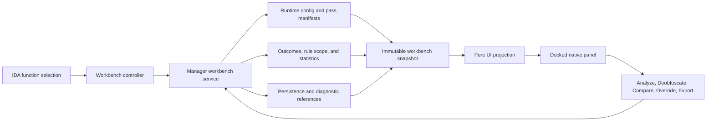

# D810 Deobfuscation Workbench UI Design

**Ticket:** d81-38ha | **Status:** DESIGN (awaiting spec review) | **Date:** 2026-07-15

## 1. Executive decision

D810's primary IDA user experience will become a function-centric
**Deobfuscation Workbench**. The workbench will explain what D810 recognized,
which runtime pipeline it selected, what each stage decided, what changed, and
why a candidate was rejected or left unchanged.

The existing flat rule tree remains available as an advanced configuration
surface. It is no longer the primary model for attacking a function.

This design has two linked deliverables:

1. A correctness prerequisite that makes source configuration, effective
   runtime configuration, and config-v2 round trips truthful and lossless.
2. A native dockable workbench for the interactive loop of inspect -> analyze
   -> deobfuscate -> explain -> compare -> refine.

The design does not turn every pass contract or diagnostic row into an editable
graph. D810 should expose evidence and decisions first, with low-level controls
behind progressive disclosure.

## 2. Why the UI must change

The engine and the UI now describe different systems.

The current configuration form presents three top-level concepts:

- Project
- Rules
- Engine Start/Stop

The runtime instead has these first-class concepts:

- source project versus effective runtime project;
- config-v2 ordered pass pipelines;
- structural shape detection and profile routing;
- pass contracts over capabilities, analyses, facts, and evidence;
- maturity eligibility and run-later scheduling;
- planning, validation, transactional mutation, and abstention;
- per-function rule and inference overlays;
- persisted outcomes and queryable diagnostic snapshots.

The mismatch is observable today. The bundled
`default_unflattening_ollvm_config_v2_canary.json` has zero top-level
`ins_rules` and `blk_rules`, so the current UI can display zero active rules.
At runtime, the same profile activates 11 passes and expands to 186 effective
instruction and block rules. Selecting the bundled source profile has the
opposite presentation problem: the UI shows the legacy source rule list while
the manager executes a different routed runtime profile.

There is also a round-trip correctness defect. The current Edit and Duplicate
paths reconstruct `ProjectConfiguration` from description, instruction rules,
and block rules only. They omit `additional_configuration`, which owns
`pipeline_v2_mode`, `pipeline_v2`, fact-provider modules, priors, and other
runtime behavior. A user copy is not eligible for bundled default routing, so
this omission silently changes a config-v2 profile into a legacy profile.

This is not a presentation-only defect. The current UI can show a different
configuration from the one being executed, and saving through it can change
execution semantics.

## 3. Audience

### 3.1 Primary: interactive reverse engineer

The primary user is looking at one suspicious function in IDA and wants to
answer:

- What kind of obstruction is present?
- What did D810 recognize structurally?
- Which profile and stages did it choose?
- Did a stage not run, find no match, abstain, or fail?
- What evidence or safety condition caused that result?
- What changed in the pseudocode, and is the result better than native output?
- Can a problematic rule or inference be scoped to this function?

This user should not need to know the producing obfuscator or select a vendor
profile before D810 attempts structural detection.

### 3.2 Secondary: rule and pass author

The contributor needs deeper access to:

- pass contracts and maturity ranges;
- required and produced facts and evidence;
- routing overrides;
- fired rules and planned mutations;
- diagnostic database and native anchors;
- profile and rule configuration.

These details are available in the workbench, but they are not the default
screen.

### 3.3 Not a target: visual pipeline programmer

This design does not create a node editor for authoring pass graphs. Project
JSON and Python registration remain the authority for advanced pipeline
construction.

### 3.4 Goals

The workbench must:

- make the selected function, not the global rule catalog, the center of the
  deobfuscation workflow;
- expose the effective runtime pipeline and its evidence without requiring the
  user to infer behavior from project JSON or logs;
- preserve configuration semantics across every UI round trip;
- distinguish ineligibility, no match, abstention, blockage, and failure;
- let users compare native and D810 output against a fresh, identified oracle;
- support safe per-function refinement without bypassing manager, persistence,
  or cache-invalidation boundaries; and
- keep contributor-only configuration and diagnostics available through
  progressive disclosure.

## 4. Design principles

1. **Function first.** The selected function is the workbench scope. Project
   configuration is policy and context, not the task itself.
2. **Shape before vendor.** Show structural classification and the selected
   dispatcher profile. Never require a vendor label for the normal path.
3. **Evidence before knobs.** Explain the current result before offering
   overrides.
4. **Truthful runtime identity.** Always distinguish source project from
   effective runtime project and show the exact configured pass IDs.
5. **No silent semantic downgrade.** A save or duplicate operation either
   preserves every unedited field or is refused with an actionable message.
6. **Abstention is a useful result.** Insufficient evidence or a safety veto is
   not rendered as a generic failure.
7. **Native decompile is the oracle.** Comparisons are against a freshly
   captured native decompile tied to the current function fingerprint, not a
   stale text snapshot.
8. **Stable anchors.** A microcode block serial is never shown without an EA
   anchor, for example `blk77@0x40ADE6`.
9. **Native IDA interaction.** Use a dockable `PluginForm` with an IDA-style
   chooser/tree model, keyboard navigation, sorting, filtering, and jump-to-EA
   actions.
10. **Thin Qt adapters.** Collection, status mapping, config round trips, and
    command validation are pure Python. Qt renders models and forwards user
    intent.

## 5. Selected approach and rejected alternatives

### 5.1 Selected: compatibility repair plus function workbench

Repair config-v2 truthfulness first, then build a read-only evidence workbench,
then add scoped actions and comparison. This provides immediate safety and
lets the interaction model grow on stable application services.

### 5.2 Rejected: patch the existing rule tree only

Adding runtime badges and preserving `additional_configuration` would stop the
worst correctness failures, but it would still teach users that attacking an
obfuscation means choosing from hundreds of rules. It does not represent
structural routing, staged recovery, or abstention.

### 5.3 Rejected: full visual pipeline editor

A graphical editor for every pass, requirement, fact, maturity, and scheduler
policy would reproduce config-v2 complexity in a harder-to-review form. It
would also make the UI responsible for validating the whole pass language.
That is not required for the interactive reverse-engineering loop.

## 6. Information architecture

The workbench is a persistent dock beside the pseudocode view. It has four
regions.

### 6.1 Function context strip

Always visible:

- function name and entry EA;
- current function fingerprint state: current or stale;
- engine state: stopped, ready, analyzing, deobfuscating, or unavailable;
- source project name;
- effective runtime project name;
- runtime mode: legacy or config-v2;
- function override and active inference indicators.

When source and runtime projects differ, both names are shown. The UI never
collapses them into a single ambiguous "Config" label.

### 6.2 Attack summary

The summary answers the highest-level questions without exposing internals:

- observed shape: MBA/arithmetic, opaque predicate, indirect transfer,
  state-machine dispatcher, mixed, unknown, or not analyzed;
- detected dispatcher mechanism when applicable: equality chain, switch
  table, indirect transfer, dynamic state machine, or unknown;
- selected profile and whether selection was automatic or overridden;
- latest run outcome;
- count of changed regions, planned mutations, applied mutations, abstentions,
  and failures;
- native baseline availability and freshness.

Unknown shape is a valid result. The summary offers evidence export and
diagnostic inspection rather than guessing a vendor.

### 6.3 Pipeline chooser

The central view is a hierarchical native chooser/tree with two explicit root
groups:

- **Effective pipeline** contains pass rows in configured execution order.
- **Supporting decisions** contains lifecycle-consumer outcomes such as rule
  scope, profile selection, and flow gates. These rows are phase-tagged but are
  not presented as members of the ordered pass pipeline.

This separation prevents a supporting observer or gate from looking like an
executable pass.

| Column | Meaning |
|-|-|
| Stage | Stable pass or consumer ID |
| Status | Exact outcome vocabulary from section 7 |
| Maturity | Configured range and observed maturity |
| Evidence | Short requirement or decision summary |
| Changes | Planned/applied count, never inferred from firing alone |

Selecting a row opens a detail pane with:

- scope and granularity;
- required capabilities, analyses, facts, and evidence;
- declared outputs, preservation, invalidation, and safety policy;
- preflight diagnostics;
- observed outcome and provenance;
- relevant anchored locations;
- links to the matching diagnostic snapshot and log artifact.

The row model is generated from structured manifests and outcome objects. The
panel must not parse human log strings to recover state already available as
data.

### 6.4 Action bar and advanced drawer

Primary actions:

- **Analyze**: run read-only recon, classification, and contract preflight.
- **Deobfuscate**: execute the effective runtime pipeline for the current
  function through the normal manager/decompiler lifecycle.
- **Compare**: show native and latest D810 pseudocode with freshness metadata.
- **Function overrides**: open the existing function-scoped rule/tags/notes
  workflow.
- **Refresh**: rebuild the view from current state without rerunning analysis.
- **Export evidence**: export the manifest, outcomes, diagnostic DB reference,
  and anchored findings for the function.

Advanced content:

- full effective rule list and fired-rule statistics;
- routing override state (`prefer`, `require`, `deny`);
- raw pass contract manifest;
- source and runtime config paths;
- logger and profiler controls;
- open configuration management.

Start and Stop remain available as engine-level controls, but they are not the
main call to action for a function.

## 7. Outcome vocabulary

The workbench must not collapse every non-change into "skipped" or every
problem into "failed".

| Status | Definition |
|-|-|
| Not run | No current result exists for this function and configuration generation |
| Ready | Static preflight is satisfied; the stage has not executed |
| Not eligible | Policy, scope, or maturity deliberately excluded the stage |
| No match | The stage executed and found no candidate |
| Changed | The stage produced a plan and at least one mutation was verified and applied |
| Unchanged | The stage executed successfully but produced no semantic change |
| Abstained | A candidate existed, but evidence, confidence, liveness, or safety policy rejected it |
| Blocked | A required capability, analysis, fact, or evidence item was unavailable before execution |
| Failed | Execution, verification, persistence, or lowering raised an error |
| Stale | The result belongs to an older function fingerprint, project generation, or decompilation generation |

Status details must name the responsible condition. Examples include
`missing fact recovered.state_transition`, `maturity not eligible`, and
`fragment rejected: non-state use-def severance`.

A pass firing count is supporting evidence only. It is not proof that the
final pseudocode changed or that the change was correct.

## 8. User flows

### 8.1 Normal function attack

1. The user opens pseudocode for a function.
2. The workbench follows the active function and shows source/runtime policy.
3. The user selects Analyze.
4. D810 performs read-only lifting, recon, shape classification, and contract
   preflight. No mutation backend is invoked.
5. The workbench shows the detected shape, selected route, ready stages, and
   any blocked or abstained decisions.
6. The user selects Deobfuscate.
7. D810 runs through its normal lifecycle and persists outcomes.
8. The chooser refreshes with per-stage outcomes and anchored evidence.
9. The user compares native and D810 pseudocode, then optionally scopes a rule
   or inference to the function.

### 8.2 Unknown or unsupported shape

1. Analyze returns Unknown or no matching family.
2. The workbench shows which detectors ran and which facts were available.
3. No vendor guess or broad unsafe profile is selected automatically.
4. Export evidence produces the smallest contributor handoff needed for CLI
   diagnosis or fixture construction.

### 8.3 Safety abstention

1. A pass identifies a candidate but rejects the fragment atomically.
2. The stage status is Abstained, not Failed or No match.
3. The detail pane shows the safety policy, exact reason, and anchored
   location.
4. The UI does not offer a generic "force" button. Any supported override must
   be a typed profile/routing option with explicit semantics.

### 8.4 Per-function refinement

1. The user opens Function overrides from the workbench.
2. The existing persisted precedence and invalidation path remains the
   authority.
3. Saving an override triggers one queued redecompile.
4. The workbench labels the run as function-overridden and records which
   effective rules changed.

## 9. Config-v2 correctness contract

The correctness milestone precedes the new workbench.

### 9.1 Source and runtime identity

The UI reads both `D810State.current_project` and
`D810State.current_runtime_project`. It also exposes
`last_config_v2_default_selection`, `last_pipeline_v2_hook_mode`, and
`last_pipeline_v2_hook_pass_ids` through a manager-level snapshot API.

The UI must show:

- source project basename and path;
- runtime project basename and path;
- whether routing occurred;
- effective pass IDs;
- whether the displayed rule list is source policy or runtime expansion.

### 9.2 Lossless save and duplicate

Every config mutation starts from the complete loaded configuration. Unknown
and unedited fields are preserved. In particular, these fields cannot be
reconstructed from the visible rule tree:

- `additional_configuration`;
- `pipeline_v2_mode` and `pipeline_v2`;
- fact profile modules and analysis priors;
- pass migration metadata;
- rule selection options inside each pass.

Duplicate of a config-v2 profile is a lossless duplicate of the effective
runtime profile with a new user path and user-visible description. For a
routed bundled source, Duplicate materializes the routed runtime profile as the
new user config. For a directly selected config-v2 profile, Duplicate copies
that profile. Neither path produces a flattened legacy rule list.

The legacy rule editor may edit legacy configs. For config-v2 profiles, it is
read-only until a field has an explicit v2-aware serializer. A save is refused
if the editor cannot prove round-trip preservation.

Configuration writes are atomic: serialize to a sibling temporary file,
reload and validate it, then replace the destination.

### 9.3 Regression witness

An automated test must cover the bundled OLLVM profile:

- source selection routes to the config-v2 runtime profile;
- the workbench reports 11 effective pass IDs for the current fixture version;
- selecting the runtime canary does not display "zero active behavior";
- a no-op duplicate preserves the full `additional_configuration` mapping;
- the duplicated user config remains config-v2 operational;
- the legacy flat editor cannot silently overwrite the v2 payload.

If the bundled pass count changes intentionally, the test fixture and expected
manifest change in the same commit.

## 10. Application and UI architecture

### 10.1 Manager-owned application service

A manager-level, IDA-independent service owns workbench collection and
commands. Its public surface returns immutable data and never returns Qt
objects or live Hex-Rays pointers.

The service responsibilities are:

- resolve current source/runtime configuration identity;
- build the effective pass manifest;
- run static contract preflight;
- collect outcome summaries, rule-scope state, statistics, and diagnostic
  references;
- validate command availability;
- schedule Analyze, Deobfuscate, baseline capture, and refresh through existing
  manager lifecycles;
- assign a monotonically increasing generation to snapshots.

The UI does not import pass registries, diagnostic ORM models, persistence
implementations, or mutation backends directly.

### 10.2 Pure workbench model

The application service returns a `DeobfuscationWorkbenchSnapshot` containing:

- `FunctionRef`: EA, name, fingerprint, generation;
- `RuntimeConfigRef`: source, runtime, mode, routed flag, pass IDs;
- `AttackSummary`: observed shape, mechanism, selected profile, selection mode;
- ordered `PipelineStageSnapshot` records;
- phase-tagged `ConsumerOutcomeSnapshot` records outside the pass order;
- `RuleScopeSummary`: project, function, and inference overlays;
- `BaselineRef` and latest D810 output reference;
- diagnostic and persistence artifact references;
- snapshot freshness and collection errors.

The types live outside `d810.ui` so headless tools and tests can consume the
same truth.

### 10.3 Pure UI projection

`d810.ui.workbench_logic` maps the immutable snapshot into row text, status
color roles, tooltips, filters, and action enablement. It has no IDA or Qt
imports.

### 10.4 Thin native adapter

`d810.ui.workbench_panel` owns:

- `PluginForm` lifecycle and docking;
- `QAbstractItemModel` or `QStandardItemModel` population;
- selection, filtering, keyboard, and context-menu wiring;
- queued refresh notifications;
- jump-to-EA and pseudocode navigation;
- rendering errors already represented by the pure model.

Qt callbacks submit commands to the application service. They do not perform
analysis, query SQLite, parse configs, or mutate rule state themselves.

### 10.5 Existing components to reuse

- `pipeline_v2_hook_activation` for effective hook/rule expansion;
- `pipeline_contract_preflight_manifest` for structured pass contracts and
  preflight diagnostics;
- `ReconOutcomeLog` and consumer adapters for cross-consumer outcomes;
- `RuleScopeService` and `RuleScopeRuntime` for function/inference overlays and
  invalidation;
- `OptimizationStatistics` for supporting counts;
- `SQLiteOptimizationStorage` and diagnostic snapshot readers for persisted
  evidence;
- the native dock/tree/filter pattern in `DeobfuscationStatsPanel`;
- existing actions for Deobfuscate, Function rules, Stats, Start, Stop,
  Loggers, and Profile.

The current Stats action remains a compatibility entry point and opens the
workbench focused on evidence. Existing action IDs stay stable for hotkeys and
scripts.

## 11. Data flow and thread boundaries

Hex-Rays callbacks never update Qt widgets directly. Runtime events enqueue a
refresh on the UI thread. SQLite reads and other potentially blocking
collection work do not run on the decompiler callback thread.

Every result carries function fingerprint, runtime-config generation, and
decompilation generation. The controller discards a result that no longer
matches the active function or current generation and renders the old result
as Stale until replacement data arrives.

## 12. Native baseline and comparison contract

Compare is evidence, not a text convenience.

- A native baseline is captured with D810 mutation hooks disabled for that
  single decompilation, without changing the persistent global engine state.
- The baseline records function fingerprint, IDB identity, relevant type
  generation, Hex-Rays version, and capture time.
- Any byte, function-boundary, type, or relevant configuration change marks
  the baseline stale.
- The D810 side records the same identity fields plus runtime project and pass
  generation.
- The compare view labels both sides and refuses to call stale output current.
- The first comparison is pseudocode and structural metrics. Diagnostic IR
  differences remain an advanced view and are not the correctness oracle.

The implementation may initially offer separate Native and D810 tabs before a
line-level diff. The freshness contract is required in either presentation.

## 13. Error handling

| Condition | UI behavior |
|-|-|
| No function selected | Empty state with navigation guidance; no warning dialog |
| Hex-Rays unavailable | Engine unavailable with one actionable Start/Load message |
| Engine stopped | Analysis availability is explicit; Deobfuscate is disabled |
| Invalid project config | Show source path and validation error; do not fall back silently |
| Unsupported v2 edit | Keep view mode and explain which field lacks a serializer |
| Missing diagnostic DB | Evidence marked unavailable; successful deobfuscation is not relabeled failed |
| Contract preflight failure | Stage Blocked with missing and available namespaces |
| Safety veto | Stage Abstained with policy and anchored reason |
| Mutation or verifier exception | Stage Failed; preserve the last valid snapshot and artifact links |
| Stale asynchronous result | Discard for current rendering and retain only as stale history |

Warnings that do not require an immediate choice appear inline. Modal dialogs
are reserved for destructive config operations or failures that prevent the
requested command.

## 14. Testing and acceptance

### 14.1 Pure unit tests

Unit tests run without IDA and cover:

- source/runtime config identity projection;
- lossless config-v2 clone and no-op save;
- refusal of unsupported v2 edits;
- pass-manifest ordering and status mapping;
- distinction among Not eligible, No match, Abstained, Blocked, and Failed;
- action enablement for every engine/function/freshness state;
- stale generation rejection;
- rule-scope and active-inference summaries;
- anchored diagnostic formatting that never emits a block serial without EA;
- export payload determinism;
- Qt/IDA import absence in service and projection modules.

### 14.2 IDA system/runtime tests

Runtime tests cover:

- panel construction and docking under supported IDA/Qt versions;
- following pseudocode function selection;
- queued refresh after decompilation and override invalidation;
- jump-to-EA actions;
- action compatibility IDs;
- Analyze does not invoke mutation;
- Deobfuscate uses the existing manager lifecycle exactly once;
- stale callback results cannot replace current-function data.

### 14.3 Headless E2E tests

E2E tests cover representative paths:

- instruction-only/MBA;
- OLLVM state-machine CFF;
- Hodur equality-chain CFF;
- Tigress indirect transfer;
- computed-goto recovery;
- unknown shape/no family;
- safety abstention;
- contract-blocked configuration.

For each case, the exported workbench snapshot is checked against the actual
runtime project, pass IDs, persisted outcomes, and diagnostic anchors. A green
UI snapshot alone does not establish semantic correctness; existing native
decompile/oracle gates remain authoritative.

### 14.4 Manual IDA acceptance

Headless tests cannot validate the complete workbench interaction. Before the
feature is called done, test in a live IDA workbench:

- dock, close, reopen, and restore placement;
- light and dark themes;
- filtering, sorting, keyboard navigation, and selection retention;
- rapid movement between functions while analysis finishes;
- context-menu and hotkey entry points;
- config-v2 source/runtime labeling;
- function override and redecompile flow;
- native/D810 comparison freshness;
- readable long diagnostics and anchored navigation.

## 15. Delivery slices

### Slice 0: stop lying about configuration

- expose source and runtime identities through a read-only snapshot;
- make duplicate/save lossless or refuse the operation;
- mark legacy versus config-v2 explicitly;
- show effective pass IDs and runtime-expanded rule counts;
- add the OLLVM round-trip regression.

### Slice 1: read-only workbench

- native dock, function following, attack summary, pipeline chooser, and detail
  pane;
- manifests, preflight, outcomes, statistics, and artifact links;
- refresh and evidence export;
- Stats action compatibility redirect.

### Slice 2: scoped interaction

- Analyze through a read-only manager path;
- Deobfuscate through the existing lifecycle;
- function override integration;
- generation-aware refresh and stale handling.

### Slice 3: native comparison

- isolated native baseline capture;
- freshness tracking;
- native versus D810 pseudocode and metrics view.

### Slice 4: v2-aware advanced editing

- structured serializers only for explicitly supported config-v2 fields;
- pass/rule selection editing with full validation;
- routing overrides;
- atomic save/reload validation.

Each slice is independently useful. Slice 0 is mandatory before exposing any
new config editing. Slice 4 does not block the function workbench.

This design is an epic boundary, not one implementation plan. After design
approval, each slice receives a child ticket and its own implementation plan.
Planning begins with Slice 0 only; later slices start after their dependencies
have met their acceptance gates.

## 16. Non-goals

- No visual node editor for arbitrary pass pipelines.
- No vendor-selection wizard as the primary routing mechanism.
- No generic "force unsafe rewrite" control.
- No embedding the full diagnostics CLI or a SQL console in the panel.
- No fixture extraction, MASM rebuilding, test registration, or CI execution
  in the primary workbench. Evidence export hands those tasks to the existing
  contributor CLI workflow.
- No whole-program batch deobfuscation dashboard in this design.
- No claim that firing counts or cleaner-looking pseudocode prove semantic
  equivalence.
- No direct Qt access to pass registries, persistence implementations, live
  Hex-Rays objects, or mutation backends.

## 17. Definition of done

The workbench effort is done only when:

1. Config-v2 source/runtime identity is truthful in every UI surface.
2. Edit and Duplicate cannot remove or change unrepresented configuration.
3. The active function's effective pass pipeline and exact outcome classes are
   visible without reading logs.
4. Abstentions, missing requirements, no-match results, and failures are
   distinct and actionable.
5. Every block reference in diagnostics includes an EA anchor.
6. Analyze is proven mutation-free, and Deobfuscate uses the established
   manager lifecycle.
7. Function overrides retain existing persistence, precedence, and cache
   invalidation semantics.
8. Native/D810 comparison enforces freshness and identifies its oracle.
9. Pure, runtime, E2E, and live IDA acceptance tiers pass.
10. Architecture gates confirm that business logic is outside Qt adapters and
    UI code has not bypassed manager/backend boundaries.
